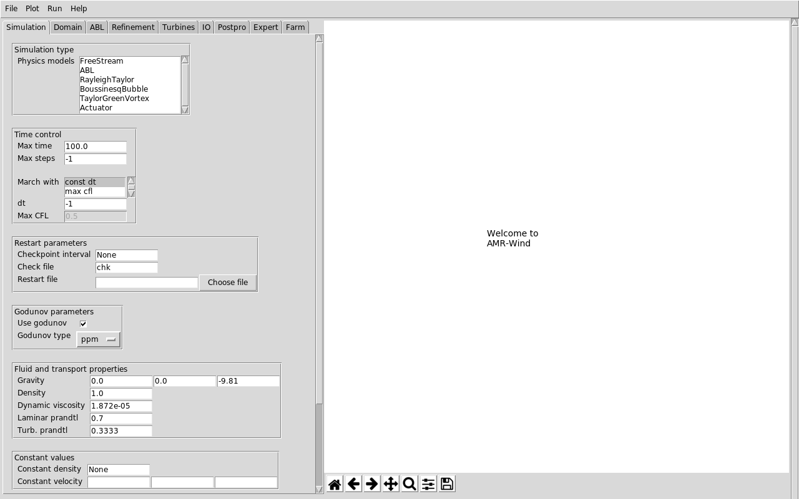

# AMR-Wind front end tool

A tool to help setup, visualize, and postprocess AMR-Wind simulations.

Built using the [TK yaml library](https://github.com/lawrenceccheung/tkyamlgui)

What can it do?
- Load an AMR-Wind input file and change parameters interactively
- Plot the simulation domain, including refinement zones and sampling
  probes/planes
- Help visualize the sampling outputs (probes, lines, and planes)
- Help postprocess ABL statistics files.
- Use it in Jupyter notebooks or python scripts to automate
  processing.

## Downloading 
You can obtain `amrwind-frontend` by downloading it from github directly:
```bash
$ git clone --recursive git@github.com:Exawind/amr-wind-frontend.git
```
### Dependencies

`amrwind-frontend` should work on both Python versions 2.7 and 3+, but
it may require some additional libraries to be installed, like
`netCDF4`.  For more information, see the [installation
documentation](docs/installing.md)

## Running
Once you've downloaded it, you can launch the interactive GUI using
the command:

```bash
$ ./amrwind_frontend.py
```

This is what it should look like:



## Documentation

See the [documentation](docs/README.md) for details on how to install,
configure, and use `amrwind-frontend`.  There are also tutorial and
example cases to explain how to set up and run AMR-Wind cases.

