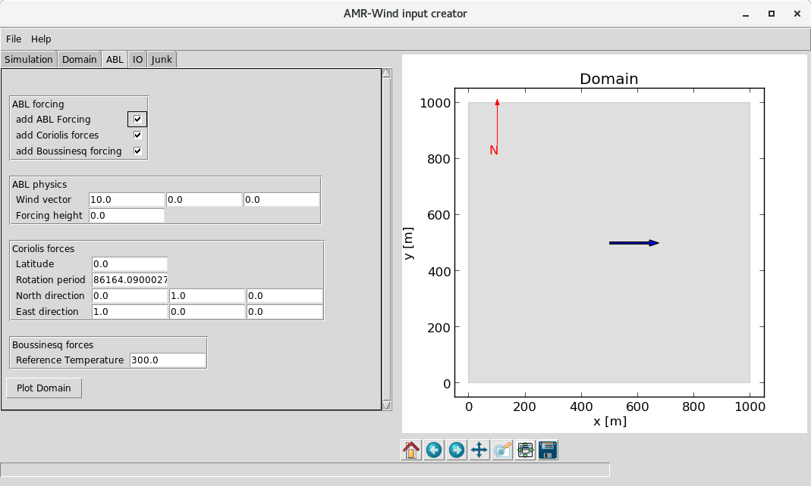

# AMR-Wind input file creator

Creates and validates an AMR-Wind input file.  

Built using the [TK yaml library](https://github.com/lawrenceccheung/tkyamlgui)

## Downloading 
Clone the repo via
```bash
$ git clone git@github.com:lawrenceccheung/amrwind-frontend.git
$ cd amrwind-frontend
$ git submodule init
$ git submodule update --recursive
```
## Running
```bash
$ ./amrwind-input.py
```

Here's a screenshot
.
