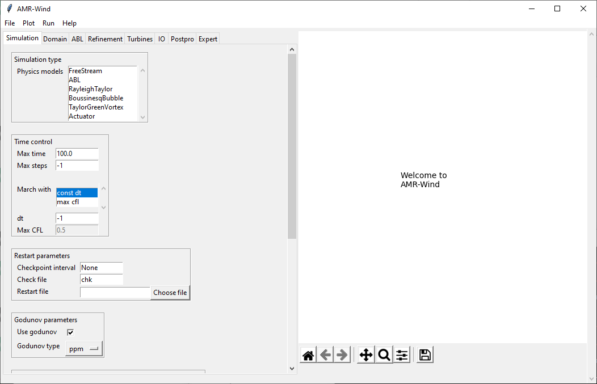

# Basics

**Contents**
- [Using the GUI](#using-the-gui)
  - [Starting amrwind_frontend](#starting-amrwind_frontend)
- [Using the python interface](#using-the-python-interface)

## Using the GUI

### Starting `amrwind_frontend`

After installing `amrwind_frontend`, you can launch the GUI frontend
using the command

```bash
$ python amrwind_frontend.py
```

or directly with 
```bash
$ ./amrwind_frontend.py
```

If there is an input file you'd like to load immediately, you can add
that as an argument to the command line

```bash
$ ./amrwind_frontend.py INPUTFILE
```

The other command line arguments that are possible can be displayed
using the `--help` argument:

```bash
$ ./amrwind_frontend.py  --help
usage: amrwind_frontend.py [-h] [--ablstatsfile ABLSTATSFILE]
                           [--samplefile SAMPLEFILE] [--outputfile OUTPUTFILE]
                           [--validate] [--localconfigdir LOCALCONFIGDIR]
                           [inputfile]

AMR-Wind

positional arguments:
  inputfile

optional arguments:
  -h, --help            show this help message and exit
  --ablstatsfile ABLSTATSFILE
                        Load the ABL statistics file [default: None]
  --samplefile SAMPLEFILE
                        Load the sample probe file [default: None]
  --outputfile OUTPUTFILE
                        Write the output file [default: None]
  --validate            Check input file for errors and quit [default: False]
  --localconfigdir LOCALCONFIGDIR
                        Local configuration directory [default:
                        /home/lcheung/hpc_home/local/Git/amrwind-
                        frontend/local]
```

When you start `amrwind_frontend`, you should see a startup screen
similar to below:



The left side of the window contains all of the inputs and parameters
required for AMR-Wind, and the right side is a plotting window used to
display images or any output required.

### Tabs

All of the various input parameters are grouped into several tabs
which span the top of the left frame.  A brief description of each tab
is below:

| Tab        | Description |
| ---        | ---         |
| Simulation | Simulation types, time-stepping, fluid and turbulence parameters |
| Domain     | Domain & mesh size, boundary conditions                          |
| ABL        | All parameters related to the ABL physics and configuration      |
| Refinement | Specifying domain refinement windows                             |
| Turbines   | Adding turbines, turbine model types, etc.                       |
| IO         | Plotting and output parameters                                   |
| Postpro    | Postprocessing the ABL statistics and sample planes              |
| Expert     | Solver tolerances and any other expert parameters                |


### Menu options

**File**
- Save input file/Save input file as: 
- Import AMR-Wind file:

**Plot**
- Plot domain
- FAST outputs

**Run**
- Check inputs
- Preview input file
- Local run
- Job submission

**Help**
- [_Help menu items are a work in progress_]

## Using the python interface

Instead of using `amrwind_frontend` interactively through the GUI, a
python interface is also available.  

### Loading the module

The python interface can be accessed by loading `amrwind_frontend` as
a library:

```python
>>> import sys
>>> sys.path.insert(1, 'amrwind-frontend')  # Add the location where it's installed.
>>> import amrwind_frontend as amrwind
```

### Start a case
```python
>>> case1=amrwind.MyApp.init_nogui()
```

Note that multiple cases can be initiated simultaneously:
```python
>>> case1=amrwind.MyApp.init_nogui()
>>> case2=amrwind.MyApp.init_nogui()
```
The inputs and parameters for `case1` and `case2` will be completely independent.

If you want to see what the current setup looks like, we can print the
input file using `writeAMRWindInput()`:

```python
>>> print(case1.writeAMRWindInput(''))
# --- Simulation time control parameters ---
time.stop_time                           = 100.0               # Max (simulated) time to evolve [s]
time.max_step                            = -1
time.fixed_dt                            = -1.0                # Fixed timestep size (in seconds). If negative, then time.cfl is used
incflo.verbose                           = 0
io.check_file                            = chk
incflo.use_godunov                       = true
incflo.godunov_type                      = ppm
incflo.gravity                           = 0.0 0.0 -9.81       # Gravitational acceleration vector (x,y,z) [m/s^2]
incflo.density                           = 1.0                 # Fluid density [kg/m^3]
transport.viscosity                      = 1.872e-05           # Fluid dynamic viscosity [kg/m-s]
transport.laminar_prandtl                = 0.7                 # Laminar prandtl number
transport.turbulent_prandtl              = 0.3333              # Turbulent prandtl number

# --- Geometry and Mesh ---
geometry.prob_lo                         = 0.0 0.0 0.0
geometry.prob_hi                         = 1000.0 1000.0 1000.0
amr.n_cell                               = 48 48 48            # Number of cells in x, y, and z directions
amr.max_level                            = 0
geometry.is_periodic                     = 1 1 0
zlo.type                                 = no_slip_wall
zhi.type                                 = no_slip_wall

# --- ABL parameters ---
ICNS.source_terms                        =
incflo.velocity                          = 10.0 0.0 0.0
ABLForcing.abl_forcing_height            = 0.0
time.plot_interval                       = 1000
io.plot_file                             = plt
io.KE_int                                = -1

#---- extra params ----
#== END AMR-WIND INPUT ==
```

#### Loading a case

```python
case1.loadAMRWindInput(filename)
```

### Setting parameters

#### Using `loadAMRWindInput`

#### Using `setAMRWindInput`

#### Retrieving parameters

### Internal versus AMR-Wind parameters

- AMR-Wind Input file parameters: 

- amrwind-frontend internal parameters: 

Every AMR-Wind parameter used in the GUI will have a corresponding
internal parameter in amrwind-frontend, but not all internal
parameters will correspond to an AMR-Wind parameters.  For instance,
the AMR-Wind parameter for gravity is `incflo.gravity`, and is linked
to the internal amrwind-frontend parameter `gravity`.  However, the
ABL averaging times variable `ablstats_avgt` is used only in the
post-processing section of amrwind-frontend, and has no corresponding
variable in the AMR-Wind input file.

### Getting help

If you need help with a specific parameter, or not sure how something
is spelled exactly, you can search for it using `getInputHelp()`.  For
instance, to find all parameters or names which contain the string
`velocity`, use

```python
>>> case1.getInputHelp('velocity')
INTERNAL NAME                            AMRWIND PARAMETER                        DEFAULT VAL / DESCRIPTION
ConstValue_velocity                      ConstValue.velocity.value
xlo_velocity                             xlo.velocity
xhi_velocity                             xhi.velocity
ylo_velocity                             ylo.velocity
yhi_velocity                             yhi.velocity
zlo_velocity                             zlo.velocity
zhi_velocity                             zhi.velocity
ABL_bndry_var_names                      ABL.bndry_var_names                      'velocity temperature'
ABL_velocity                             incflo.velocity                          [10.0, 0.0, 0.0]
perturb_velocity                         ABL.perturb_velocity                     0
sampling_fields                          sampling.fields                          'velocity'
```

