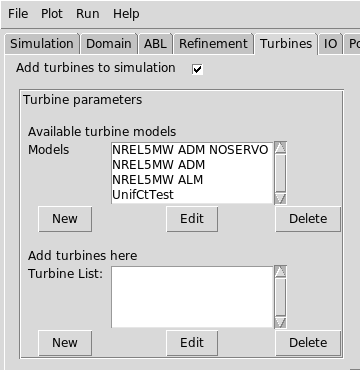

# Turbine repository

**Contents**
- [Overview](#overview)
- [Turbine repository directory](#turbine-repository-directory)
- [YAML file structure](#yaml-file-structure)

## Overview

`amrwind-frontend` offers the ability to store frequently used turbine
models in a repository so they can be quickly re-used in future
setups.  These are the turbines that are seen in the _Available
turbine models_ section in the **Turbines** tab:



Turbines in this repository have all of the basic information stored
(like turbine geometry, OpenFAST parameters, etc.), as well as any
necessary configuration files so they can be automatically copied in.
Of course, `amrwind-frontend` offers the ability to add to the turbine
repository and customize turbines that are already there.

## Turbine repository directory

By default, everything needed for the turbine repository is stored in
the [`turbines`](../turbines) subdirectory in the `amrwind-frontend`
github folder.  This location is defined in the
`preferences_turbinedir` internal variable, and can be overridden to
point to a different directory if desired.

Following the procedures in the [customization](customizing.md) guide,
simply create a yaml file in the [local](../local) subdirectory with
the following information:

```yaml
inputwidgets:
  # Change the turbine repo dir to myturbinedir
  - name:       preferences_turbinedir
    defaultval: myturbinedir
```

where `myturbinedir` is the new location you'd like to use as your
turbine repository.

Inside the `turbines/` directory should be a set of yaml files and an
optional README.md file.  `amrwind-frontend` will read every yaml in
the directory and populate the turbine repository based on what's
there.

```
turbines/
|-- ge25-116.yaml
|-- nrel5mw.yaml
|-- OpenFAST_NREL5MW
\-- README.md
```

## YAML file structure

Each yaml file in the `turbines/` directory should have a specific
structure.  There should be a `turbines:` section at the top, with all
turbines underneath.  A single yaml file can define one or multiple
turbines, or even zero turbines if the `turbines:` section is not
there.

For instance, the definition of the NREL 5MW actuator line model is

```yaml
turbines:
  nre5mwALM:
    turbinetype_name:             "NREL5MW ALM"
    turbinetype_comment:          "Any comment you want to add"
    Actuator_type:                TurbineFastLine
    Actuator_openfast_input_file: OpenFAST_NREL5MW/nrel5mw.fst
    Actuator_rotor_diameter:      126
    Actuator_hub_height:          90
    Actuator_num_points_blade:    64
    Actuator_num_points_tower:    12
    Actuator_epsilon:             [10.0, 10.0, 10.0]
    Actuator_epsilon_tower:       [5.0, 5.0, 5.0]
    Actuator_openfast_start_time: 0.0
    Actuator_openfast_stop_time:  1000.0
    Actuator_nacelle_drag_coeff:  0.0
    Actuator_nacelle_area:        0.0
    Actuator_output_frequency:    10
    turbinetype_filedir:          OpenFAST_NREL5MW
```

Note that `nre5mwALM` is (purposely?) misspelled -- that tag has no
particular meaning, as long as it is unique.  

Each parameter below `nre5mwALM` should be an _internal_ variable
name.  Some of these variables correspond to specific `AMR-Wind`
inputs (particularly those that start with `Actuator_`), while others
correspond to parameters which are only useful to `amrwind-frontend`
(like `turbinetype_filedir`).

|Parameter             | Description |
| ---                  | ---         |
| `turbinetype_name`   | Name of the turbine model which will appear in the selection window, and which will be referred to by the python interface |
|`turbinetype_comment` | An arbitrary comment used to distinguish models (currently unused, but could be used in the future) |
|`turbinetype_filedir` | The directory containing all parameter files necessary for the turbine model definition.  |

Note that the `turbinetype_filedir`, if it exists, will automatically
get copied over to the simulation directory when the user chooses to
use the turbine model.  However, the name of the turbine will be
automatically be prepended to the directory name.  For instance, if
the turbine name is called `turbineFOO`, and `turbinetype_filedir` is
`BARdir`, then the directory will be copied over as
`turbineFOO_BARdir`.  The directory reference in
`Actuator_openfast_input_file` will be automatically adjusted to the
new name as well.