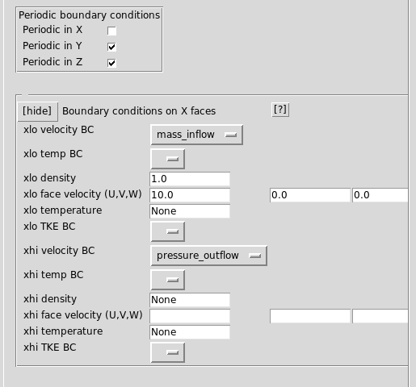
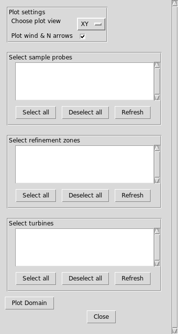
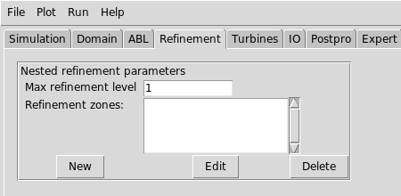
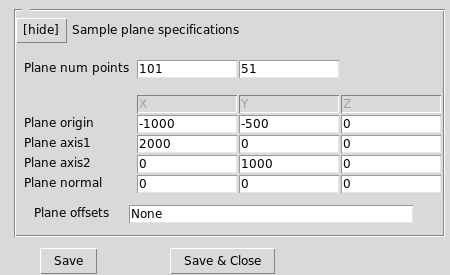
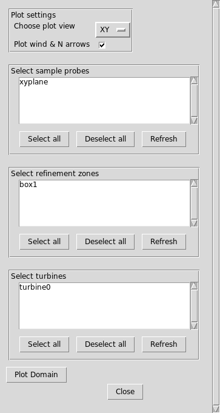
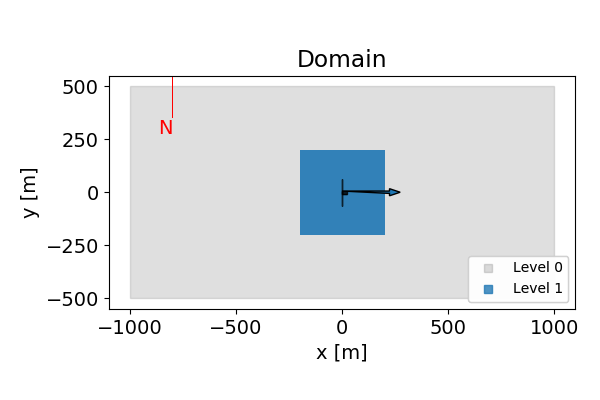

# Tutorial 1: Setting up a turbine run  

**Contents**  
-   [Tutorial 1: Setting up a turbine
    run](#tutorial-1-setting-up-a-turbine-run)
    -   [Introduction](#introduction)
    -   [Getting started](#getting-started)
    -   [Set the simulation type and
        properties](#set-the-simulation-type-and-properties)
    -   [Domain and Boundary
        conditions](#domain-and-boundary-conditions)
    -   [ABL Wind direction](#abl-wind-direction)
        -   [Plot the domain (optional)](#plot-the-domain-optional)
    -   [Adding a turbine](#adding-a-turbine)
    -   [Adding a refinement region](#adding-a-refinement-region)
    -   [Adding a sampling plane](#adding-a-sampling-plane)
    -   [Plotting the domain](#plotting-the-domain)
    -   [Checking the inputs](#checking-the-inputs)
    -   [Save the input file](#save-the-input-file)
    -   [Running the job](#running-the-job)
        -   [Running locally](#running-locally)
        -   [Running on the cluster](#running-on-the-cluster)
    -   [Postprocessing](#postprocessing)
        -   [Plotting the FAST output](#plotting-the-fast-output)
        -   [Plotting the sample plane](#plotting-the-sample-plane)


## Introduction

This tutorial will demonstrate how to set up a simple AMR-Wind case
with a single turbine, one refinement window, and one sampling plane.

| Setting    | Value          |
| ---        | ---            |
| Turbine    | NREL 5MW       |
| Wind type  | Uniform inflow |
| Wind Speed | 10.0 m/s       |


At the end of this tutorial, you should be able to create an input
file to run, submit, and postprocess the outputs.

## Getting started

First create the directory where case will be setup and run:
```bash
$ mkdir tutorial1
$ cd tutorial1
```

Then launch the `amrwind_frontend` program:  
```bash
$ /PATH/TO/amrwind_frontend.py
```

This should launch `amrwind_frontend` and look something like this:  


## Set the simulation type and properties

In the Simulation tab, we'll first choose the simulation type and
basic run length.

In the **Simulation type** list, choose both `['FreeStream', 'Actuator']`.

Under **Time control**, choose **March with** `['const dt']`, set
**Max time** to `100` and **dt** to `0.1`:


Scroll down to the end of the tab, and we'll change some more
simulation properties.  Under **Constant values**, change
- **Constant density** = `1.0`
- **Constant velocity** = `[10.0, 0.0, 0.0]`

Also choose `['Laminar']` under the **Turbulence model** options:  


## Domain and Boundary conditions

To set up the domain and boundary conditions, click on the **Domain**
tab and add the following information.

Under **Domain and mesh**, put in the following information:  
- **Domain corner 1**: `[-1000, -500, -500]`
- **Domain corner 2**: `[1000, 500, 500]`
- **Mesh size**: `[128, 64, 64]`


Under **Periodic Boundary conditions**, check both **Periodic in Y** and
**Periodic in Z** to make both y and z directions periodic.  Then click on 
**[show]** next to the Boundary conditions on X faces, and add
the following information:

- **xlo velocity BC**: `mass_inflow`
- **xlo density**: `1.0`
- **xlo face velocity (U,V,W)**: `[10.0, 0.0, 0.0]`
- **xhi velocity BC**: `pressure_outflow`

The other fields can be left empty or `None`:  


## ABL Wind direction

In the **ABL** tab, set 
- **Wind vector** to `[10.0, 0.0, 0.0]`

You can check the wind speed and direction by pressing **[Calc
WS/WDir]**, which should calculate the wind speed as 10.0 m/s and wind
direction from 270 degrees:


### Plot the domain (optional)

To see the orientation of the wind vector with respect to the
computational domain, we can plot the domain as it's currently set up.
Under the **Plot** menu, select **Plot domain**:



This window gives several options for plotting items in the the
AMR-Wind setup.  Right now there are no other items available to plot,
so just press the **[Plot Domain]** button to see the domain:


Then press **[Close]** to exit the plot domain window.

## Adding a turbine

In the **Turbines** tab, check the box next to **Add turbines to simulation**.  


Then under **Add turbines here**, click the **New** button.  

In the name field, add `turbine0` (this can be arbitrary.) Then 
select `NREL5MW ADM NOSERVO` under **Use turbine type** and hit **Load**.


Fill in the turbine base position, yaw, and density

- **Base position** = `[0, 0, -90]`
- **Nacelle Yaw**   = `270.0`
- **Density**       = `1.0`


Then hit the **[Save & Update FAST]** button at the bottom to make sure all OpenFAST parameters are consistent.

Finally, hit the **[Close]** button. 

## Adding a refinement region

To add a refinement region, select the **Refinement** tab.  Then add
set **Max refinement level** to `1` to add one level of
refinement.



Press **[New]** to open the **Refinement windows** dialog box.  Add
the information in the following fields:

- **Name**: `box1` -- this can be arbitrary
- **Type**: `GeometryRefinement` -- for refinement based on a geometry shape.


Then expand the **Geometry refinement details** section and add the
following information:

- **Geometry Names**: `box1` -- this can be arbitrary
- **Geometry level**: `0` -- note that the refinement will be _applied_ on level `0` to produce refined cells at level `1`.
- **Geometry type**: `box`
- **Box corner**: `[-200, -200, -200]`
- **Box axis 1**: `[400, 0, 0]`
- **Box axis 2**: `[0, 400, 0]`
- **Box axis 3**: `[0, 0, 400]`


Then press **[Save & Close]** to complete the refinement
specification.

## Adding a sampling plane

The last element to be added to the simulation case is a sampling
plane to help visualize the solution.  Click on the **IO** tab, and
click on the `sampling` option to add sampling probes.

Set the **Output freq** to `100`, and choose
`['velocity']` as the variable to plot.  Then press **[New]** to
create a new sampling probe input.


In the Sampling probe dialog window, insert the information in the
following fields:

- Name: `xyplane` -- this can be arbitrary
- Type: `PlaneSampler`


Then expand the **Sample plane specifications** section and add the following:
- Plane num points: `101 51`
- Plane origin: `-1000 -500 0`
- Plane axis1: `2000 0 0`
- Plane axis2: `0 1000 0`



Once this is complete, press **[Save]** and **[Close]**.  Now you
should see that `xyplane` has been added to the list of probes:  


## Plotting the domain

Now that the turbine, refinement regions, and sampling planes have
been added, we can replot the domain and see how everything is
configured. Under the **Plot** menu, select **Plot domain**:



This window should now show that the turbines, sample planes, and grid 
refinements which can be included in the plot.

If `box1` and `turbine0` are selected, as in below:


and then **[Plot Domain]** is
pressed, the turbine and refinement configuration is shown:



If `xplane` and `turbine0` are selected, you can see how the sampling
probes cover the domain:


## Checking the inputs

Before running this case, we can check that the inputs have been set
up correctly.  Under the **Run** menu, select **Check inputs**.

The output in the terminal will show the results of the check:
```
-- Checking inputs --
[ PASS] max_level:           max_level = 1 >= 0
[ PASS] dt & CFL:            DT and CFL OK
[ PASS] Actuator physics:    incflo.physics and ICNS.source_terms OK for Actuators
[ PASS] Actuator FST:turbine0 [turbine0_OpenFAST_NREL5MW/nrel5mw_noservo.fst] exists
[ PASS] Actuator FST:turbine0 CompInflow OK
[ PASS] Actuator FST:turbine0 [turbine0_OpenFAST_NREL5MW/./5MW_Baseline/NRELOffshrBsline5MW_Onshore_AeroDyn15.dat] exists
[ PASS] Actuator FST:turbine0 WakeMod=0 OK
[ PASS] Actuator FST:turbine0 AirDens=1.000000, matches incflo.density=1.000000
[ PASS] Sampling probes:xyplane 

Results: 
 9 PASS
 0 SKIP
 0 FAIL
 0 WARN

```

If anything is set up incorrectly, it may show up as `FAIL` or `WARN`
checks in the results.


## Save the input file

To write the input file for AMR-Wind, go to the **File** menu and
select **Save input file** (or **Save input file As**).  This will
open up the file dialog window, where you can provide the name of the
file to save (`tutorial1.inp` in this case):


After it saves the file, you should see the input file and the
OpenFAST directory: 

```bash
$ ls -1
turbine0_OpenFAST_NREL5MW
tutorial1.inp
```

The file `tutorial1.inp` should look similar to:
<details>
  <summary>Expand input file</summary>
<pre>
# --- Simulation time control parameters ---
time.stop_time                           = 100.0               # Max (simulated) time to evolve [s]
time.max_step                            = -1                  
time.fixed_dt                            = 0.1                 # Fixed timestep size (in seconds). If negative, then time.cfl is used
incflo.physics                           = FreeStream Actuator # List of physics models to include in simulation.
incflo.verbose                           = 0                   
io.check_file                            = chk                 
incflo.use_godunov                       = true                
incflo.godunov_type                      = ppm                 
turbulence.model                         = Laminar             
incflo.gravity                           = 0.0 0.0 -9.81       # Gravitational acceleration vector (x,y,z) [m/s^2]
incflo.density                           = 1.0                 # Fluid density [kg/m^3]
transport.viscosity                      = 1.872e-05           # Fluid dynamic viscosity [kg/m-s]
transport.laminar_prandtl                = 0.7                 # Laminar prandtl number
transport.turbulent_prandtl              = 0.3333              # Turbulent prandtl number
ConstValue.density.value                 = 1.0                 
ConstValue.velocity.value                = 10.0 0.0 0.0        
# --- Geometry and Mesh ---
geometry.prob_lo                         = -1000.0 -500.0 -500.0
geometry.prob_hi                         = 1000.0 500.0 500.0  
amr.n_cell                               = 128 64 64           # Number of cells in x, y, and z directions
amr.max_level                            = 1                   
geometry.is_periodic                     = 0 1 1               
xlo.type                                 = mass_inflow         
xlo.density                              = 1.0                 
xlo.velocity                             = 10.0 0.0 0.0        
xhi.type                                 = pressure_outflow    
# --- ABL parameters ---
ICNS.source_terms                        =    ActuatorForcing  
incflo.velocity                          = 10.0 0.0 0.0        
ABLForcing.abl_forcing_height            = 0.0                 
time.plot_interval                       = 1000                
io.plot_file                             = plt                 
io.KE_int                                = -1                  
incflo.post_processing                   = sampling            
# --- Sampling parameters ---
sampling.output_frequency                = 100                 
sampling.fields                          = velocity            
#---- sample defs ----
sampling.labels                          = xyplane             
sampling.xyplane.type                    = PlaneSampler        
sampling.xyplane.num_points              = 101 51              
sampling.xyplane.origin                  = -1000.0 -500.0 0.0  
sampling.xyplane.axis1                   = 2000.0 0.0 0.0      
sampling.xyplane.axis2                   = 0.0 1000.0 0.0      
sampling.xyplane.normal                  = 0.0 0.0 0.0         
#---- tagging defs ----
tagging.labels                           = box1                
tagging.box1.type                        = GeometryRefinement  
tagging.box1.shapes                      = box1                
tagging.box1.level                       = 0                   
tagging.box1.box1.type                   = box                 
tagging.box1.box1.origin                 = -200.0 -200.0 -200.0
tagging.box1.box1.xaxis                  = 400.0 0.0 0.0       
tagging.box1.box1.yaxis                  = 0.0 400.0 0.0       
tagging.box1.box1.zaxis                  = 0.0 0.0 400.0       
#---- actuator defs ----
Actuator.labels                          = turbine0            
Actuator.turbine0.type                   = TurbineFastDisk     
Actuator.turbine0.openfast_input_file    = turbine0_OpenFAST_NREL5MW/nrel5mw_noservo.fst
Actuator.turbine0.base_position          = 0.0 0.0 -90.0       
Actuator.turbine0.rotor_diameter         = 126.0               
Actuator.turbine0.hub_height             = 90.0                
Actuator.turbine0.num_points_blade       = 64                  
Actuator.turbine0.num_points_tower       = 12                  
Actuator.turbine0.epsilon                = 10.0 10.0 10.0      
Actuator.turbine0.epsilon_tower          = 5.0 5.0 5.0         
Actuator.turbine0.openfast_start_time    = 0.0                 
Actuator.turbine0.openfast_stop_time     = 1000.0              
Actuator.turbine0.nacelle_drag_coeff     = 0.0                 
Actuator.turbine0.nacelle_area           = 0.0                 
Actuator.turbine0.yaw                    = 270.0               
Actuator.turbine0.output_frequency       = 10                  
Actuator.turbine0.density                = 1.0                 
#---- extra params ----
#== END AMR-WIND INPUT ==
</pre>
</details>

## Running the job
To run the case, there are two possibilities.  The case can be run on
the local machine, or a submission file can be generated to run on an
HPC cluster.

Note that the following instructions require that
`amrwind_frontend.py` is set up correctly with the right paths and
locations to the executable.

<!-- NOTE THIS STUFF IS NOT YET AUTOMATICALLY GENERATED -->

### Running locally

This option can be used if there are sufficient resources on the local
machine.

Under the **Run** menu, select **Local run**.  If properly configured,
most of the executable and paths should not need to be changed.
Provide a **Log filename** (like `log.txt`) and set the number of
processors in **N processors** (default `1`).

Then press **[Save & Run]** to start the run


### Running on the cluster

You can create a submission script for running on the HPC machines.
Under the **Run** menu, select **Job submission**.  


Fill in the following fields: 

- **submit script filename**: `submit.sh`
- **amr_wind executable**: `amr_wind` (Provide full path if necessary)
- **job name**: `amrwind1` (can be arbitrary)
- **Number of nodes**: `4`
- **Run time**: `1:00:00` 


To see what the submission script looks like, click on **[Preview
script]** button.  Then click on **[Save script]** to write the file.

To submit the job through the interface, hit **Submit job**, although
it can also be done on the command line, e.g., through
```bash
$ bsub < submit.sh
```
or through SLURM systems: 
```bash
$ sbatch submit.sh
```

## Postprocessing

### Plotting the FAST output

Under the **Plot** menu, select **Fast outputs**.


Click on **[Add file]** and select the file
`turbine0_OpenFAST_NREL5MW/nrel5mw_noservo.out`.  Then click on
**[Load/Reload Data]** to load the data.

Once the data is loaded, select one of the variables such as `Wind1VelX`:  


Then press `[Plot]` to plot the FAST output:   


### Plotting the sample plane  

In the **Postpro** tab, scroll down to the **Plot Sample Planes** tab.
Then press **[Choose file]** and choose the file
`post_processing/sampling00000.nc`, and press **[Load file]**.  This
will load the NetCDF data file and show the available groups to plot.
Select `xyplane` and press **[Load variables]**


This should load the available variables to plot.  Select `velocityx`
in the **NetCDF vars** list, and choose `X` and `Y` as **Plot axis 1**
and **Plot axis 2**, respectively.  (`AUTO` is the automatic option.)
Under `Set current time`, put `10` (the last data sample).


Then press **[Plot Sample]** to plot a contour of the x-velocity at
the hub-height plane:


