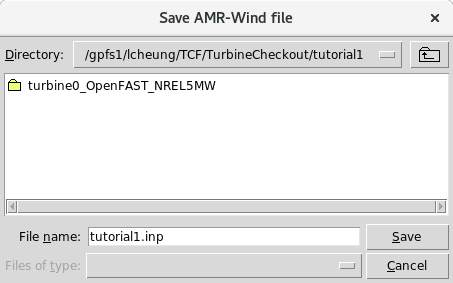
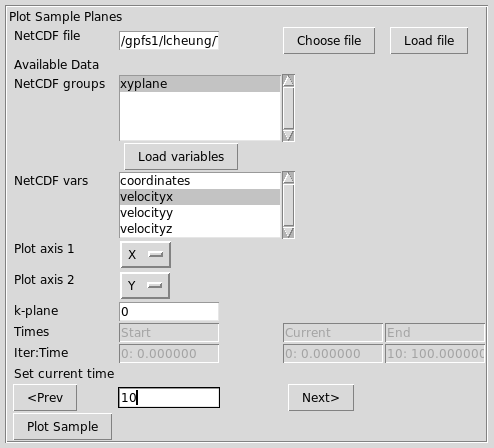
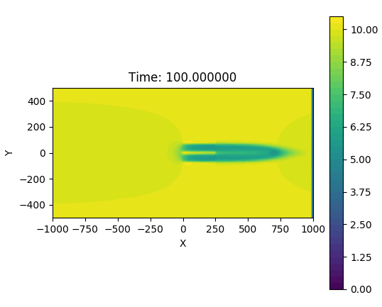

# Tutorial 1: Setting up a turbine run  

**Contents**  
-   [Tutorial 1: Setting up a turbine
    run](#tutorial-1-setting-up-a-turbine-run)
    -   [Introduction](#introduction)
    -   [Getting started](#getting-started)
    -   [Set the simulation type and
        properties](#set-the-simulation-type-and-properties)
    -   [Domain and Boundary
        conditions](#domain-and-boundary-conditions)
    -   [ABL Wind direction](#abl-wind-direction)
        -   [Plot the domain (optional)](#plot-the-domain-optional)
    -   [Adding a turbine](#adding-a-turbine)
    -   [Adding a refinement region](#adding-a-refinement-region)
    -   [Adding a sampling plane](#adding-a-sampling-plane)
    -   [Plotting the domain](#plotting-the-domain)
    -   [Checking the inputs](#checking-the-inputs)
    -   [Save the input file](#save-the-input-file)
    -   [Running the job](#running-the-job)
        -   [Running locally](#running-locally)
        -   [Running on the cluster](#running-on-the-cluster)
    -   [Postprocessing](#postprocessing)
        -   [Plotting the FAST output](#plotting-the-fast-output)
        -   [Plotting the sample plane](#plotting-the-sample-plane)


## Introduction

This tutorial will demonstrate how to set up a simple AMR-Wind case
with a single turbine, one refinement window, and one sampling plane.

| Setting    | Value          |
| ---        | ---            |
| Turbine    | NREL 5MW       |
| Wind type  | Uniform inflow |
| Wind Speed | 10.0 m/s       |


At the end of this tutorial, you should be able to create an input
file to run, submit, and postprocess the outputs.

## Getting started

First create the directory where case will be setup and run:
```bash
$ mkdir tutorial1
$ cd tutorial1
```

Then launch the `amrwind_frontend` program:  
```bash
$ /PATH/TO/amrwind_frontend.py
```

This should launch `amrwind_frontend` and look something like this:  


## Set the simulation type and properties

In the Simulation tab, we'll first choose the simulation type and
basic run length.

In the **Simulation type** list, choose both `{incflo_physics}`.

Under **Time control**, choose **March with** `{time_control}`, set
**Max time** to `{time_stop_time}` and **dt** to `{time_fixed_dt}`:


Scroll down to the end of the tab, and we'll change some more
simulation properties.  Under **Constant values**, change
- **Constant density** = `{ConstValue_density_value}`
- **Constant velocity** = `{ConstValue_velocity_value}`

Also choose `{turbulence_model}` under the **Turbulence model** options:  


## Domain and Boundary conditions

To set up the domain and boundary conditions, click on the **Domain**
tab and add the following information.

Under **Domain and mesh**, put in the following information:  
- **Domain corner 1**: `{geometry_prob_lo}`
- **Domain corner 2**: `{geometry_prob_hi}`
- **Mesh size**: `{amr_n_cell}`


Under **Periodic Boundary conditions**, check both **Periodic in Y** and
**Periodic in Z** to make both y and z directions periodic.  Then click on 
**[show]** next to the Boundary conditions on X faces, and add
the following information:

- **xlo velocity BC**: `{xlo_type}`
- **xlo density**: `{xlo_density}`
- **xlo face velocity (U,V,W)**: `{xlo_velocity}`
- **xhi velocity BC**: `{xhi_type}`

The other fields can be left empty or `None`:  


## ABL Wind direction

In the **ABL** tab, set 
- **Wind vector** to `{incflo_velocity}`

You can check the wind speed and direction by pressing **[Calc
WS/WDir]**, which should calculate the wind speed as 10.0 m/s and wind
direction from 270 degrees:


### Plot the domain (optional)

To see the orientation of the wind vector with respect to the
computational domain, we can plot the domain as it's currently set up.
Under the **Plot** menu, select **Plot domain**:


This window gives several options for plotting items in the the
AMR-Wind setup.  Right now there are no other items available to plot,
so just press the **[Plot Domain]** button to see the domain:


Then press **[Close]** to exit the plot domain window.

## Adding a turbine

In the **Turbines** tab, check the box next to **Add turbines to simulation**.  


Then under **Add turbines here**, click the **New** button.  

In the name field, add `{Actuator_name}` (this can be arbitrary.) Then 
select `{use_turbine_type}` under **Use turbine type** and hit **Load**.


Fill in the turbine base position, yaw, and density

- **Base position** = `{Actuator_base_position}`
- **Nacelle Yaw**   = `{Actuator_yaw}`
- **Density**       = `{Actuator_density}`


Then hit the **[Save & Update FAST]** button at the bottom to make sure all OpenFAST parameters are consistent.

Finally, hit the **[Close]** button. 

## Adding a refinement region

To add a refinement region, select the **Refinement** tab.  Then add
set **Max refinement level** to `{amr_max_level}` to add one level of
refinement.


Press **[New]** to open the **Refinement windows** dialog box.  Add
the information in the following fields:

- **Name**: `{tagging_name}` -- this can be arbitrary
- **Type**: `{tagging_type}` -- for refinement based on a geometry shape.


Then expand the **Geometry refinement details** section and add the
following information:

- **Geometry Names**: `{tagging_shapes}` -- this can be arbitrary
- **Geometry level**: `{tagging_level}` -- note that the refinement will be _applied_ on level `0` to produce refined cells at level `1`.
- **Geometry type**: `{tagging_geom_type}`
- **Box corner**: `{tagging_geom_origin}`
- **Box axis 1**: `{tagging_geom_xaxis}`
- **Box axis 2**: `{tagging_geom_yaxis}`
- **Box axis 3**: `{tagging_geom_zaxis}`


Then press **[Save & Close]** to complete the refinement
specification.

## Adding a sampling plane

The last element to be added to the simulation case is a sampling
plane to help visualize the solution.  Click on the **IO** tab, and
click on the `sampling` option to add sampling probes.

Set the **Output freq** to `{sampling_output_frequency}`, and choose
`{sampling_fields}` as the variable to plot.  Then press **[New]** to
create a new sampling probe input.


In the Sampling probe dialog window, insert the information in the
following fields:

- Name: `xyplane` -- this can be arbitrary
- Type: `PlaneSampler`


Then expand the **Sample plane specifications** section and add the following:
- Plane num points: `101 51`
- Plane origin: `-1000 -500 0`
- Plane axis1: `2000 0 0`
- Plane axis2: `0 1000 0`


Once this is complete, press **[Save]** and **[Close]**.  Now you
should see that `xyplane` has been added to the list of probes:  


## Plotting the domain

Now that the turbine, refinement regions, and sampling planes have
been added, we can replot the domain and see how everything is
configured. Under the **Plot** menu, select **Plot domain**:


This window should now show that the turbines, sample planes, and grid 
refinements which can be included in the plot.

If `box1` and `turbine0` are selected, as in below:


and then **[Plot Domain]** is
pressed, the turbine and refinement configuration is shown:


If `xplane` and `turbine0` are selected, you can see how the sampling
probes cover the domain:


## Checking the inputs

Before running this case, we can check that the inputs have been set
up correctly.  Under the **Run** menu, select **Check inputs**.

The output in the terminal will show the results of the check:
```
{checkoutput}
```

If anything is set up incorrectly, it may show up as `FAIL` or `WARN`
checks in the results.


## Save the input file

To write the input file for AMR-Wind, go to the **File** menu and
select **Save input file** (or **Save input file As**).  This will
open up the file dialog window, where you can provide the name of the
file to save (`tutorial1.inp` in this case):



After it saves the file, you should see the input file and the
OpenFAST directory: 

```bash
$ ls -1
turbine0_OpenFAST_NREL5MW
tutorial1.inp
```

The file `tutorial1.inp` should look similar to:
<details>
  <summary>Expand input file</summary>
<pre>
{inputfilestr}
</pre>
</details>

## Running the job
To run the case, there are two possibilities.  The case can be run on
the local machine, or a submission file can be generated to run on an
HPC cluster.

Note that the following instructions require that
`amrwind_frontend.py` is set up correctly with the right paths and
locations to the executable.

<!-- NOTE THIS STUFF IS NOT YET AUTOMATICALLY GENERATED -->

### Running locally

This option can be used if there are sufficient resources on the local
machine.

Under the **Run** menu, select **Local run**.  If properly configured,
most of the executable and paths should not need to be changed.
Provide a **Log filename** (like `log.txt`) and set the number of
processors in **N processors** (default `1`).

Then press **[Save & Run]** to start the run


### Running on the cluster

You can create a submission script for running on the HPC machines.
Under the **Run** menu, select **Job submission**.  


Fill in the following fields: 

- **submit script filename**: `submit.sh`
- **amr_wind executable**: `amr_wind` (Provide full path if necessary)
- **job name**: `amrwind1` (can be arbitrary)
- **Number of nodes**: `4`
- **Run time**: `1:00:00` 


To see what the submission script looks like, click on **[Preview
script]** button.  Then click on **[Save script]** to write the file.

To submit the job through the interface, hit **Submit job**, although
it can also be done on the command line, e.g., through
```bash
$ bsub < submit.sh
```
or through SLURM systems: 
```bash
$ sbatch submit.sh
```

## Postprocessing

### Plotting the FAST output

Under the **Plot** menu, select **Fast outputs**.


Click on **[Add file]** and select the file
`turbine0_OpenFAST_NREL5MW/nrel5mw_noservo.out`.  Then click on
**[Load/Reload Data]** to load the data.

Once the data is loaded, select one of the variables such as `Wind1VelX`:  


Then press `[Plot]` to plot the FAST output:   


### Plotting the sample plane  

In the **Postpro** tab, scroll down to the **Plot Sample Planes** tab.
Then press **[Choose file]** and choose the file
`post_processing/sampling00000.nc`, and press **[Load file]**.  This
will load the NetCDF data file and show the available groups to plot.
Select `xyplane` and press **[Load variables]**


This should load the available variables to plot.  Select `velocityx`
in the **NetCDF vars** list, and choose `X` and `Y` as **Plot axis 1**
and **Plot axis 2**, respectively.  (`AUTO` is the automatic option.)
Under `Set current time`, put `10` (the last data sample).



Then press **[Plot Sample]** to plot a contour of the x-velocity at
the hub-height plane:


