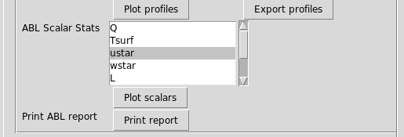

# Tutorial 2: Postprocessing a convectively unstable LES ABL calculation

<!-- NOTE: The tutorial is actually generated by make_tutorial2postpro.py -->

<!--INTROTEXTSETUP-->
## Introduction

This tutorial will demonstrate the following features:
- How to use `amrwind-frontend` to postprocess an LES ABL case.

<!--INTROTEXTEND-->

## Load the ABL stat file

| Parameter           | Value           |
| ---                 | ---             |
| ABL Statistics file | post_processing/abl_statistics00000.nc |
| Avg times           | [15000, 20000] |
| Avg heights         | 57.19 |


Press **[Print report]**, then the output in the command line window
should look like:

```

Loading w'theta'_r
Loading theta
Loading u
Loading v'v'_r
Loading v
Loading u'u'_r
Loading w'w'_r
        z       Uhoriz      WindDir       TI_TKE     TI_horiz        Alpha     ObukhovL 
      ===         ====         ====         ====         ====         ====         ==== 
    57.19 6.129959e+00 2.300725e+02 6.614705e-02 1.035226e-01 2.969138e-02 -4.795765e+01 

```

## Plot the friction velocity and ABL forcing

Select `ustar` in the **ABL Scalar Stats** selection box:  



Then press the **[Plot scalars]** button.  You should see a plot which
looks like this:


Now unselect `ustar` from the selection box and scroll down to select
both `abl_forcing_x` and `abl_forcing_y`.  Then press the **[Plot
scalars]** button again.


## Plot the velocity profile


## Plot the sampling plane file 

and hit **[Load file]**: 


