# Tutorial 2: Setting up an LES ABL calculation

<!-- NOTE: The tutorial is actually generated by make_tutorial2setup.py -->

<!--INTROTEXTSETUP-->
## Introduction

This tutorial will demonstrate the following features: 
- How to use `amrwind-frontend` to set up an LES ABL case.

### Background

The desired conditions for this ABL case are derived from the IEA29
REF1 conditions measured off of the coast of Denmark.  

| Parameter                 | Value                             |
| ---                       | ---                               |
| Turbine hub height        | 57.19 m |
| Hub height wind speed     | 6.13 m/s               |
| Hub height wind direction | 230.07 degrees             |
| Hub height TI             | 0.068                             |
| Hub height shear exponent | 0.0025                            |
<!--INTROTEXTEND-->

## Simulation settings

In the **Simulation** tab, go to the **Simulation type** window, and 
choose `['ABL']` for **Physics models**.

Then under the **Time control** section, set the following parameters:

| Parameter  | Value            |
| ---        | ---              |
| Max time   | 20000.0 |
| Max steps  | 40000  |
| March with | `const dt` |
| dt         | 0.5  |

Under **Restart parameters**, set **Check file** to `chk`
and **Checkpoint interval** to `2000`.
Then the settings at the top of the tab should look like:  

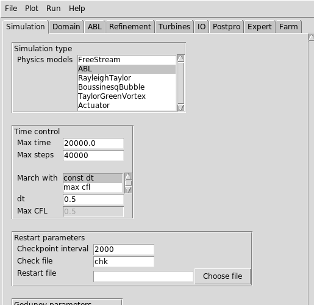

Now in the **Fluid and transport properties** section, set the
following:

| Parameter         | Value                 |
| ---               | ---                   |
| Dynamic viscosity | 1.8375e-05 |

In the **Godunov parameters** section and the **Turbulence
parameters** section, set the following parameters:

| Parameter        | Value                 |
| ---              | ---                   |
| Use godunov      | True  |
| Godunov type     | weno |
| Turbulence model | ['OneEqKsgsM84']    |
| TKE source terms | ['KsgsM84Src']    |

After setting these variables, the bottom part of the tab should look
like:

## Domain and boundary conditions

In the **Domain** tab, we'll set the computational domain and boundary
conditions.

| Parameter       | Value              | Comment                               |
| ---             | ---                | ---                                   |
| Domain corner 1 | [0.0, 0.0, 0.0] |                                       |
| Domain corner 2 | [1536.0, 1536.0, 1920.0] |                                       |
| Mesh size       | [128, 128, 160]       | Number of cells in X, Y, Z directions |
| Periodic in X   | True     |                                       |
| Periodic in Y   | True     |                                       |
| Periodic in Z   | False     | Z is not periodic                     |

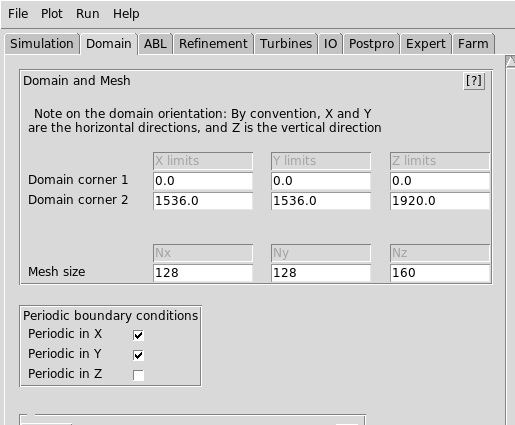

Now we'll set the boundary conditions on the upper and lower Z
surfaces. Press **[show]** next to **Boundary conditions on Z faces**,
then use these parameter values in the following fields, and you can
leave the remainder of them blank.

| Parameter       | Value                  | Comment                          |
| ---             | ---                    | ---                              |
| zlo velocity BC | wall_model             |                                  |
| zlo temp BC     | wall_model |                                  |
| zlo TKE BC      | zero_gradient         |                                  |
| zhi velocity BC | slip_wall             |                                  |
| zhi temp BC     | fixed_gradient |                                  |
| zhi temperature | 0.000974025974      | This is actually the dT/dz value |

It should look like this in the front-end interface:
	
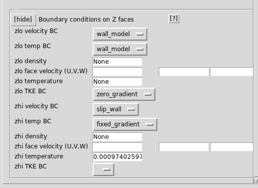

## ABL settings

In the **ABL** tab, we'll add the necessary physical values for an ABL
simulation.  First in the **ABL Forcing** window, check the following
items:

| Parameter              | Value               |
| ---                    | ---                 |
| add ABL Forcing        | True        |
| add Coriolis forces    | True   |
| add Boussinesq forcing | True |

Next we'll set the ABL wind speed and direction.  In the **ABL
physics** section, check the **Use speed & dir instead** checkbox,
then use the following variables:

| Parameter      | Value                           |
| ---            | ---                             |
| Wind speed     | 6.13                 |
| Wind direction | 230.07                   |
| Forcing height | 57.19 |

 Then hit the **[Calc W. Vec]** button, and it should automatically
 calculate the correct wind vector to use.  Under the **ABL
 properties** section, fill in the following values:
 
| Parameter            | Value                       |
| ---                  | ---                         |
| kappa                | 0.4                 |
| ABL normal direction | 2      |
| z0 roughness         | 0.0001  |
| ABL ref temp         | 288.15 |
| surf temp rate       | 0.0     |
| surf temp flux       | 0.0122096146646     |
| M.O. beta_m          | 16.0             |
| M.O. gamma_m         | 5.0            |
| M.O. gamma_h         | 5.0            |
 

In the **Coriolis forces** and **Boussinesq forces** sections, put in
the following parameters:

| Parameter             | Value                                      |
| ---                   | ---                                        |
| Latitude              | 55.49                 |
| Reference Temperature | 288.15 |

The top part of the **ABL** tab should then look like:  

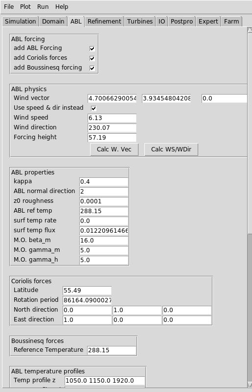

Scrolling down the same tab, next we'll specify the initial
temperature profile in the **ABL temperature profiles** section:

| Parameter        | Value                     |
| ---              | ---                       |
| Temp profile z   | 1050.0 1150.0 1920.0 |
| Temp profile val | 288.15 296.15 296.9  |

In the **ABL perturbations** tab, we're going to override the amr-wind
frontend defaults, by putting `None` in a number of fields.  Using
`None` will prevent these parameters from appearing in the final input
file.

| Parameter               | Value                    |
| ---                     | ---                      |
| Ref z for vel perturb   | None |
| Num of periods in x     | None           |
| Num of periods in y     | None           |
| Amp. of U fluct.        | None             |
| Amp. of V fluct.        | None             |
| Amp. of T perturbations | None    |
| Max T perturb height    | None      |

In the **ABL output parameters** section, put in the following inputs.

| Parameter        | Value                        |
| ---              | ---                          |
| Output frequency | 1 |
| Output format    | netcdf    |

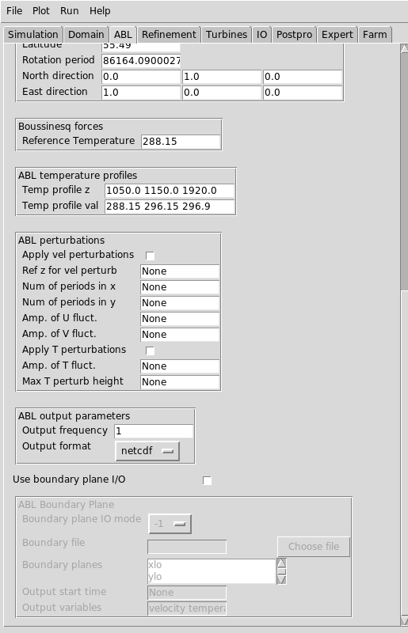

## IO settings

In this section, we're going to be specifying the outputs and the
sampling probes in the simulation.  In the **IO** tab, we'll first set
some generic parameters in the **Plot Ouputs** section:  

| Parameter     | Value                |
| ---           | ---                  |
| Verbosity     | 3     |
| Plot interval | 2000 |

Under **Post processing**, select `['sampling']`.  Then
in the **Sampling probes** section, set the following values:  

| Parameter   | Value                       |
| ---         | ---                         |
| Output freq | 100 |
| Variables   | ['velocity', 'temperature']           |

The tab should then looks something similar to:  

Now we're going to set up 3 different sets of sampling planes.  One
set will be for hub-height X-Y planes, another for the X boundary
planes, and one for the Y boundary planes.  To set up the hub height
planes, click on the **[New]** in the **Sampling probes** section,
then put in the following information at the top:

| Parameter | Value       |
| ---       | ---         |
| Name      | p_hub |
| Type      | PlaneSampler |

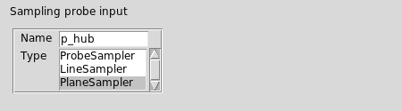

Click on the **[show]** button under **Sample plane specifications**
and then put in the following details:  

| Parameter        | Value         |
| ---              | ---           |
| Plane num points | [129, 129]   |
| Plane origin     | [0, 0, 0] |
| Plane axis1      | [1536, 0, 0]  |
| Plane axis2      | [0, 1536, 0]  |
| Plane normal     | [0, 0, 1] |
| Plane offsets    | 17        28.5      41        57        77        90 |

That part of the windows should then look like:  

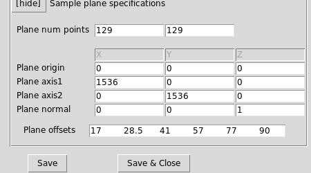

Then click **[Save & Close]**.

Now to set up the X boundary sample planes, click on **[New]** again
and put in these values at the top:

| Parameter | Value      |
| ---       | ---        |
| Name      | xbc |
| Type      | PlaneSampler |

And in the **Sample plane specifications**, put in these values: 

| Parameter        | Value        |
| ---              | ---          |
| Plane num points | [257, 161]   |
| Plane origin     | [0, 0, 0] |
| Plane axis1      | [0, 1536, 0]  |
| Plane axis2      | [0, 0, 1920]  |
| Plane normal     | [1, 0, 0] |
| Plane offsets    | 0.0 1536 |

which will look like this in the window: 

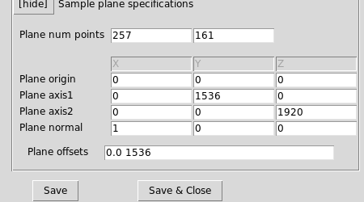

Then click **[Save & Close]**.  For the Y boundary planes, use these inputs 

| Parameter | Value      |
| ---       | ---        |
| Name      | ybc |
| Type      | PlaneSampler |

And these geometry settings: 

| Parameter        | Value        |
| ---              | ---          |
| Plane num points | [257, 161]   |
| Plane origin     | [0, 0, 0] |
| Plane axis1      | [1536, 0, 0]  |
| Plane axis2      | [0, 0, 1920]  |
| Plane normal     | [0, 1, 0] |
| Plane offsets    | 0.0 1536 |

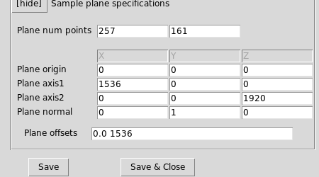

Then click **[Save & Close]**.  

## Expert settings

In the last settings for the simulation, we'll put in a few details in
the **Expert** tab.  This is optional, and mostly to keep things
consistent with previous ABL solutions.  Put in the following values
in the **Tolerances** section:  

| Parameter                     | Value                           |
| ---                           | ---                             |
| nodal_proj.mg_rtol            | 1e-06            |
| nodal_proj.mg_atol            | 1e-12            |
| mac_proj.mg_rtol              | 1e-06              |
| mac_proj.mg_atol              | 1e-12              |
| diffusion.mg_rtol             | 1e-06             |
| diffusion.mg_atol             | 1e-12             |
| temperature_diffusion.mg_rtol | 1e-10 |
| temperature_diffusion.mg_atol | 1e-13 |

In the **Numerics** section, put in the following values: 

| Parameter             | Value                   |
| ---                   | ---                     |
| Random Gauss mean     | 0.0 |
| Random Gauss Variance | 1.0  |

The resulting tab should then look like: 

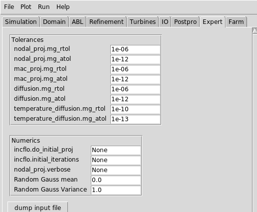

## Plot of the domain

To visualize the domain with the ABL forcing and the sampling planes,
click on the menu bar's **Plot** --> **Plot domain** option.  Then
under the **Select sample probes** section, choose **[Select all]**:  

Now press **[Plot Domain]** and you should see the following plotted: 

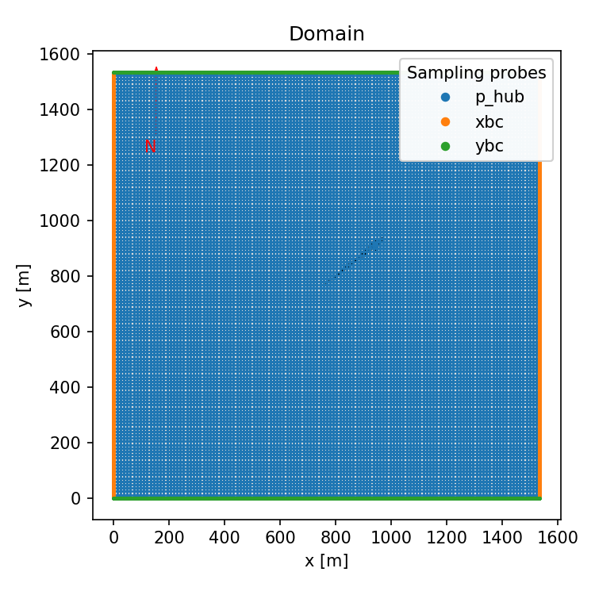

## Writing the input file

To see what the AMR-Wind input file would look like, you can go to the
menu bar, select **Run** --> **Preview Input File**, to see the
preview window.  Then, once you're satisfied with the way things look,
you can hit **File** --> **Save input file as** to save it to a file.

The result should be similar to 

  
[input file]

<pre>
# --- Simulation time control parameters ---
time.stop_time                           = 20000.0             # Max (simulated) time to evolve [s]
time.max_step                            = 40000               
time.fixed_dt                            = 0.5                 # Fixed timestep size (in seconds). If negative, then time.cfl is used
time.checkpoint_interval                 = 2000                
incflo.physics                           = ABL                 # List of physics models to include in simulation.
incflo.verbose                           = 3                   
io.check_file                            = chk                 
incflo.use_godunov                       = true                
incflo.godunov_type                      = weno                
turbulence.model                         = OneEqKsgsM84        
TKE.source_terms                         = KsgsM84Src          
nodal_proj.mg_rtol                       = 1e-06               
nodal_proj.mg_atol                       = 1e-12               
mac_proj.mg_rtol                         = 1e-06               
mac_proj.mg_atol                         = 1e-12               
diffusion.mg_rtol                        = 1e-06               
diffusion.mg_atol                        = 1e-12               
temperature_diffusion.mg_rtol            = 1e-10               
temperature_diffusion.mg_atol            = 1e-13               
incflo.gravity                           = 0.0 0.0 -9.81       # Gravitational acceleration vector (x,y,z) [m/s^2]
incflo.density                           = 1.0                 # Fluid density [kg/m^3]
transport.viscosity                      = 1.8375e-05          # Fluid dynamic viscosity [kg/m-s]
transport.laminar_prandtl                = 0.7                 # Laminar prandtl number
transport.turbulent_prandtl              = 0.3333              # Turbulent prandtl number
# --- Geometry and Mesh ---
geometry.prob_lo                         = 0.0 0.0 0.0         
geometry.prob_hi                         = 1536.0 1536.0 1920.0
amr.n_cell                               = 128 128 160         # Number of cells in x, y, and z directions
amr.max_level                            = 0                   
geometry.is_periodic                     = 1 1 0               
zlo.type                                 = wall_model          
zlo.temperature_type                     = wall_model          
zlo.tke_type                             = zero_gradient       
zhi.type                                 = slip_wall           
zhi.temperature_type                     = fixed_gradient      
zhi.temperature                          = 0.000974025974      
# --- ABL parameters ---
ICNS.source_terms                        = ABLForcing BoussinesqBuoyancy CoriolisForcing 
ABL.stats_output_frequency               = 1                   
ABL.stats_output_format                  = netcdf              
incflo.velocity                          = 4.70066290054 3.93454804209 0.0
ABLForcing.abl_forcing_height            = 57.19               
ABL.kappa                                = 0.4                 
ABL.normal_direction                     = 2                   
ABL.surface_roughness_z0                 = 0.0001              
ABL.reference_temperature                = 288.15              
ABL.surface_temp_rate                    = 0.0                 
ABL.surface_temp_flux                    = 0.0122096146646     # Surface temperature flux [K-m/s]
ABL.mo_beta_m                            = 16.0                # Monin-Obukhov Beta m parameter
ABL.mo_gamma_m                           = 5.0                 # Monin-Obukhov Gamma m parameter
ABL.mo_gamma_h                           = 5.0                 # Monin-Obukhov Gamma h parameter
ABL.random_gauss_mean                    = 0.0                 
ABL.random_gauss_var                     = 1.0                 
CoriolisForcing.latitude                 = 55.49               
CoriolisForcing.rotational_time_period   = 86164.0900027       
CoriolisForcing.north_vector             = 0.0 1.0 0.0         
CoriolisForcing.east_vector              = 1.0 0.0 0.0         
BoussinesqBuoyancy.reference_temperature = 288.15              
ABL.temperature_heights                  = 1050.0 1150.0 1920.0
ABL.temperature_values                   = 288.15 296.15 296.9 
ABL.perturb_velocity                     = false               
ABL.perturb_temperature                  = false               
time.plot_interval                       = 2000                
io.plot_file                             = plt                 
io.KE_int                                = -1                  
incflo.post_processing                   = sampling            
# --- Sampling parameters ---
sampling.output_frequency                = 100                 
sampling.fields                          = velocity temperature
#---- sample defs ----
sampling.labels                          = p_hub xbc ybc       
sampling.p_hub.type                      = PlaneSampler        
sampling.p_hub.num_points                = 129 129             
sampling.p_hub.origin                    = 0.0 0.0 0.0         
sampling.p_hub.axis1                     = 1536.0 0.0 0.0      
sampling.p_hub.axis2                     = 0.0 1536.0 0.0      
sampling.p_hub.normal                    = 0.0 0.0 1.0         
sampling.p_hub.offsets                   = 17        28.5      41        57        77        90
sampling.xbc.type                        = PlaneSampler        
sampling.xbc.num_points                  = 257 161             
sampling.xbc.origin                      = 0.0 0.0 0.0         
sampling.xbc.axis1                       = 0.0 1536.0 0.0      
sampling.xbc.axis2                       = 0.0 0.0 1920.0      
sampling.xbc.normal                      = 1.0 0.0 0.0         
sampling.xbc.offsets                     = 0.0 1536            
sampling.ybc.type                        = PlaneSampler        
sampling.ybc.num_points                  = 257 161             
sampling.ybc.origin                      = 0.0 0.0 0.0         
sampling.ybc.axis1                       = 1536.0 0.0 0.0      
sampling.ybc.axis2                       = 0.0 0.0 1920.0      
sampling.ybc.normal                      = 0.0 1.0 0.0         
sampling.ybc.offsets                     = 0.0 1536            
#---- extra params ----
#== END AMR-WIND INPUT ==
</pre>

