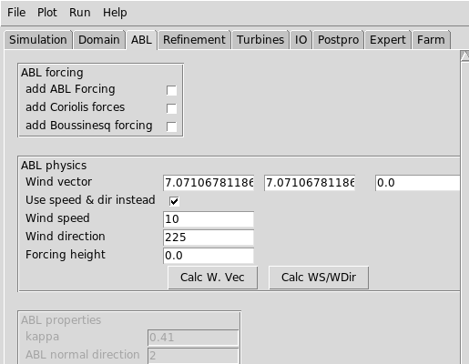
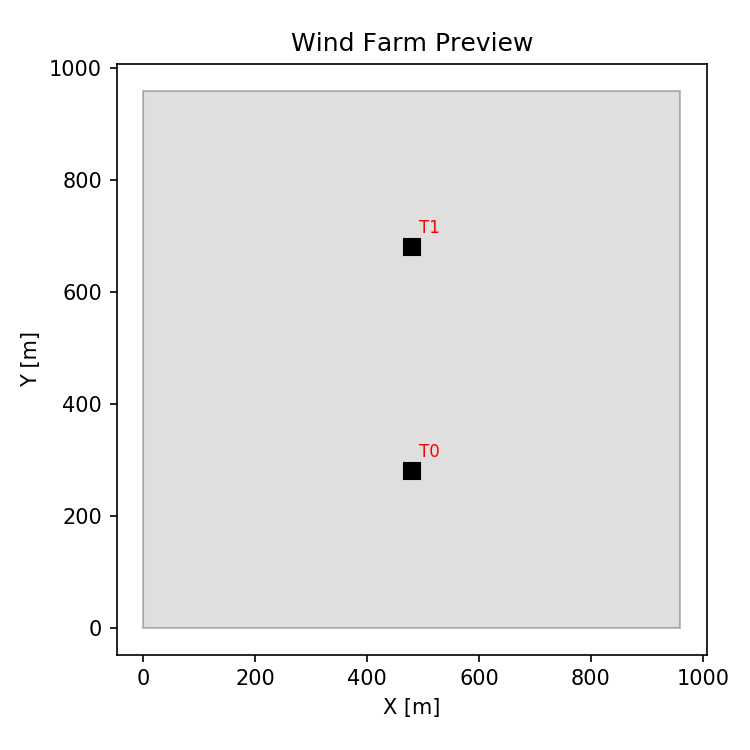
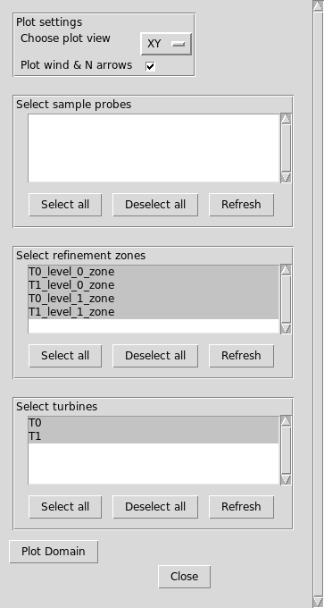

# Tutorial 3: Setting up a farm calculation

<!-- Variables within braces (between { and }) will be replaced by
the python script make_tutorial3_gui_markdownimages.py -->

## Introduction

This tutorial will do something...

## Set some wind properties

WS = 10  m/s
WDir =  225 degrees

| Input                   | Value      |
| ---                     | ---        |
| Use speed & dir instead | True |
| Wind speed              | 10       |
| Wind direction          | 225     |



Hit the **[Calc WS/WDir]** button, and it should fill in the values of
the Wind Vector appropriately.

## Create wind farm layout and domain

The first thing we'll do is to set the wind farm layout and set the
location of each of the turbines. Click on the **Farm** tab, and hit
**[show]** next to **Wind farm turbine layout**.

Copy and paste this input into the **CSV Contents** window.
```
# CSV file should have columns with
# name, x, y, type, yaw, hubheight, options
T0, 500, 300, UnifCtTest, , ,
T1, 500, 700, UnifCtTest, , ,
```

If you have all of the turbine inputs in a separate CSV file, you can
also load them by hitting **[Choose file]**, then selecting the file,
and hitting **[Load/Reload]**.

The other inputs in the
| Input                    | value              |
| ---                      | ---                |
| Farm domain size (X,Y,Z) | [1000, 1000, 1000]       |
| Background mesh size [m] | 10 |


If you have questions about what each of the columns in the CSV input
mean, hit the **[?]** button.  You should see a help window that
resembles:

### TURBINE LAYOUT SPECIFICATIONS

| column      | description                                                                       | required/optional |
| ---         | ---                                                                               | ---               |
| `name`      | The name of the turbine (can be arbitrary).                                       | required          |
| `x`         | The x position of the turbine.                                                    | required          |
| `y`         | The y position of the turbine.                                                    | required          |
| `type`      | The turbine type (must be listed under turbine types tab)                         | required          |
| `yaw`       | The turbine yaw heading.  If not specified, turbine points directly into the wind | optional          |
| `hubheight` | The turbine hub-height.  If not specified, uses the default from the turbine type | optional          |
| `options`   | Optional parameters                                                               | optional          |


Press the **[Preview]** button under **Actions**.  It should generate
a turbine and domain layout image which resembles something like this:  



There should be two turbines labeled T1 and T0 in the middle of a 1 km
x 1 km domain.

If you want to adjust any turbine positions or orientations, go back
and edit the CSV input above.  Then press the **[Create turbines]**
button to actually create the turbines in the simulation.

To verify that the turbines are actually created, click the
**Turbines** tab and then look at the **Turbine List** under **Add
turbines here**.  You should see that both T0 and T1 are included in
the list:


## Create wind farm refinement zones  

Now around each turbine, we'll add some refinement zones so the
turbine rotors can be resolved.  Click back on the **Farm** tab, and
hit **[show]** next to **Farm refinement zones**.

```
# CSV file should have columns with
# level, upstream, downstream, lateral, below, above, options
level, upstream, downstream, lateral, below, above, options
0,     1,    1,   1,   0.75, 1, 
1,     0.5,  0.5, 0.5, 0.75, 1, 
```


If you have questions about what each of the CSV columns are supposed
to mean, hit the **[?]** button.  You should see a help window with
the following information:

### REFINEMENT SPECIFICATIONS

| column       | description                                                      | required/optional |
| ---          | ---                                                              | ---               |
| `level`      | The mesh level to apply the refinement.                          | required          |
| `upstream`   | The number of diameters or meters upstream to apply refinement   | required          |
| `downstream` | The number of diameters or meters downstream to apply refinement | required          |
| `lateral`    | The number of diameters or meters off to side of each turbine    | required          |
| `below`      | The number of diameters or meters below the turbine hub-height   | required          |
| `above`      | The number of diameters or meters above the turbine hub-height   | required          |
| `options`    | Any additional options (see below)                               | optional          |

### OPTIONAL INPUTS
| keyword       | default    | possible values               | description                                          |
| ---           | ---        | ---                           | ---                                                  |
| `orientation` | `winddir`  | `winddir`, `nacdir`, `x`, `y` | Which direction the refinement box should be pointed |
| `units`       | `diameter` | `diameter`, `meter`           | What units the values are in                         |
| `center`      | `turbine`  | `turbine`, `farm`             | Where the center of the refinement zone is located   |


Press the **[Create refinements]** button to ceate the refinement
zones.  Then, to see what the refinement zones look like, open the
plot domain dialog on the menu bar: **Plot**-->**Plot domain**.  You
should see that there 4 refinement zones present, and the two
previously created turbines also present.  



Hit **[Select all]** for both the refinement zones and turbines, then
press **[Plot Domain]**.  You should see both turbines plotted, and
each refinement level around the turbines shown.  Everything should be
oriented so that it points into the wind:


## Create sampling planes

```
# CSV file should have columns withturbinescsv=
# name, type, upstream, downstream, lateral, below, above, n1, n2, options
name, type, upstream, downstream, lateral, below, above, n1, n2, options
cl1, centerline, 1,  0, none, none,  none,  11, 11, none
rp1, rotorplane, 2,  0, none, none,  none,  11, 11, none
sw1, streamwise, 2,  1, 1, 0.5,  0.5,  11, 11, usedx:0.25 noffsets:1
hh,  hubheight,  2,  1, 1, 0,  none,  11, 11, usedx:0.25 center:farm orientation:x
```


### REFINEMENT SPECIFICATIONS

| column       | description                                                      | required/optional |
| ---          | ---                                                              | ---               |
| `level`      | The mesh level to apply the refinement.                          | required          |
| `upstream`   | The number of diameters or meters upstream to apply refinement   | required          |
| `downstream` | The number of diameters or meters downstream to apply refinement | required          |
| `lateral`    | The number of diameters or meters off to side of each turbine    | required          |
| `below`      | The number of diameters or meters below the turbine hub-height   | required          |
| `above`      | The number of diameters or meters above the turbine hub-height   | required          |
| `options`    | Any additional options (see below)                               | optional          |

### OPTIONAL INPUTS
| keyword       | default    | possible values               | description                                          |
| ---           | ---        | ---                           | ---                                                  |
| `orientation` | `winddir`  | `winddir`, `nacdir`, `x`, `y` | Which direction the refinement box should be pointed |
| `units`       | `diameter` | `diameter`, `meter`           | What units the values are in                         |
| `center`      | `turbine`  | `turbine`, `farm`             | Where the center of the refinement zone is located   |


## See the output 

To see what the AMR-Wind input file would look like, you can go to the
menu bar, select **Run** --> **Preview Input File**, to see the
preview window (you can also just hit **File** --> **Save input file
as** to save it to a file).

The input file should look similar to:  
<details>
  <summary>[Expand input file]</summary>
<pre>
# --- Simulation time control parameters ---
time.stop_time                           = 100.0               # Max (simulated) time to evolve [s]
time.max_step                            = -1                  
time.fixed_dt                            = -1.0                # Fixed timestep size (in seconds). If negative, then time.cfl is used
incflo.verbose                           = 0                   
io.check_file                            = chk                 
incflo.use_godunov                       = true                
incflo.godunov_type                      = ppm                 
incflo.gravity                           = 0.0 0.0 -9.81       # Gravitational acceleration vector (x,y,z) [m/s^2]
incflo.density                           = 1.0                 # Fluid density [kg/m^3]
transport.viscosity                      = 1.872e-05           # Fluid dynamic viscosity [kg/m-s]
transport.laminar_prandtl                = 0.7                 # Laminar prandtl number
transport.turbulent_prandtl              = 0.3333              # Turbulent prandtl number
# --- Geometry and Mesh ---
geometry.prob_lo                         = 0.0 0.0 0.0         
geometry.prob_hi                         = 1000.0 1000.0 1000.0
amr.n_cell                               = 100 100 100         # Number of cells in x, y, and z directions
amr.max_level                            = 2                   
geometry.is_periodic                     = 1 1 0               
zlo.type                                 = no_slip_wall        
zhi.type                                 = no_slip_wall        
# --- ABL parameters ---
ICNS.source_terms                        =    ActuatorForcing  
ABLForcing.abl_forcing_height            = 0.0                 
time.plot_interval                       = 1000                
io.plot_file                             = plt                 
io.KE_int                                = -1                  
incflo.post_processing                   = sampling            
# --- Sampling parameters ---
sampling.output_frequency                = 100                 
sampling.fields                          = velocity            
#---- sample defs ----
sampling.labels                          = T0_cl1 T1_cl1 T0_rp1 T1_rp1 T0_sw1 T1_sw1 Farm_hh
sampling.T0_cl1.type                     = LineSampler         
sampling.T0_cl1.num_points               = 11                  
sampling.T0_cl1.start                    = 417.975613382 217.975613382 80.0
sampling.T0_cl1.end                      = 500.0 300.0 80.0    
sampling.T1_cl1.type                     = LineSampler         
sampling.T1_cl1.num_points               = 11                  
sampling.T1_cl1.start                    = 417.975613382 617.975613382 80.0
sampling.T1_cl1.end                      = 500.0 700.0 80.0    
sampling.T0_rp1.type                     = PlaneSampler        
sampling.T0_rp1.num_points               = 11 11               
sampling.T0_rp1.origin                   = 294.939033456 176.963420074 22.0
sampling.T0_rp1.axis1                    = 82.0243866176 -82.0243866176 0.0
sampling.T0_rp1.axis2                    = 0.0 0.0 116.0       
sampling.T0_rp1.normal                   = 0.0 0.0 0.0         
sampling.T1_rp1.type                     = PlaneSampler        
sampling.T1_rp1.num_points               = 11 11               
sampling.T1_rp1.origin                   = 294.939033456 576.963420074 22.0
sampling.T1_rp1.axis1                    = 82.0243866176 -82.0243866176 0.0
sampling.T1_rp1.axis2                    = 0.0 0.0 116.0       
sampling.T1_rp1.normal                   = 0.0 0.0 0.0         
sampling.T0_sw1.type                     = PlaneSampler        
sampling.T0_sw1.num_points               = 13 5                
sampling.T0_sw1.origin                   = 335.951226765 135.951226765 22.0
sampling.T0_sw1.axis1                    = 246.073159853 246.073159853 0.0
sampling.T0_sw1.axis2                    = 0.0 0.0 116.0       
sampling.T0_sw1.normal                   = 0.707106781187 -0.707106781187 0.0
sampling.T0_sw1.offsets                  = 0.0 116.0           
sampling.T1_sw1.type                     = PlaneSampler        
sampling.T1_sw1.num_points               = 13 5                
sampling.T1_sw1.origin                   = 335.951226765 535.951226765 22.0
sampling.T1_sw1.axis1                    = 246.073159853 246.073159853 0.0
sampling.T1_sw1.axis2                    = 0.0 0.0 116.0       
sampling.T1_sw1.normal                   = 0.707106781187 -0.707106781187 0.0
sampling.T1_sw1.offsets                  = 0.0 116.0           
sampling.Farm_hh.type                    = PlaneSampler        
sampling.Farm_hh.num_points              = 13 9                
sampling.Farm_hh.origin                  = 268.0 384.0 80.0    
sampling.Farm_hh.axis1                   = 348.0 0.0 0.0       
sampling.Farm_hh.axis2                   = 0.0 232.0 0.0       
sampling.Farm_hh.normal                  = 0.0 0.0 0.0         
#---- tagging defs ----
tagging.labels                           = T0_level_0_zone T1_level_0_zone T0_level_1_zone T1_level_1_zone
tagging.T0_level_0_zone.type             = GeometryRefinement  
tagging.T0_level_0_zone.shapes           = T0_level_0_zone     
tagging.T0_level_0_zone.level            = 0                   
tagging.T0_level_0_zone.T0_level_0_zone.type = box                 
tagging.T0_level_0_zone.T0_level_0_zone.origin = 335.951226765 300.0 -7.0
tagging.T0_level_0_zone.T0_level_0_zone.xaxis = 164.048773235 164.048773235 0.0
tagging.T0_level_0_zone.T0_level_0_zone.yaxis = 164.048773235 -164.048773235 0.0
tagging.T0_level_0_zone.T0_level_0_zone.zaxis = 0.0 0.0 203.0       
tagging.T1_level_0_zone.type             = GeometryRefinement  
tagging.T1_level_0_zone.shapes           = T1_level_0_zone     
tagging.T1_level_0_zone.level            = 0                   
tagging.T1_level_0_zone.T1_level_0_zone.type = box                 
tagging.T1_level_0_zone.T1_level_0_zone.origin = 335.951226765 700.0 -7.0
tagging.T1_level_0_zone.T1_level_0_zone.xaxis = 164.048773235 164.048773235 0.0
tagging.T1_level_0_zone.T1_level_0_zone.yaxis = 164.048773235 -164.048773235 0.0
tagging.T1_level_0_zone.T1_level_0_zone.zaxis = 0.0 0.0 203.0       
tagging.T0_level_1_zone.type             = GeometryRefinement  
tagging.T0_level_1_zone.shapes           = T0_level_1_zone     
tagging.T0_level_1_zone.level            = 1                   
tagging.T0_level_1_zone.T0_level_1_zone.type = box                 
tagging.T0_level_1_zone.T0_level_1_zone.origin = 417.975613382 300.0 -7.0
tagging.T0_level_1_zone.T0_level_1_zone.xaxis = 82.0243866176 82.0243866176 0.0
tagging.T0_level_1_zone.T0_level_1_zone.yaxis = 82.0243866176 -82.0243866176 0.0
tagging.T0_level_1_zone.T0_level_1_zone.zaxis = 0.0 0.0 203.0       
tagging.T1_level_1_zone.type             = GeometryRefinement  
tagging.T1_level_1_zone.shapes           = T1_level_1_zone     
tagging.T1_level_1_zone.level            = 1                   
tagging.T1_level_1_zone.T1_level_1_zone.type = box                 
tagging.T1_level_1_zone.T1_level_1_zone.origin = 417.975613382 700.0 -7.0
tagging.T1_level_1_zone.T1_level_1_zone.xaxis = 82.0243866176 82.0243866176 0.0
tagging.T1_level_1_zone.T1_level_1_zone.yaxis = 82.0243866176 -82.0243866176 0.0
tagging.T1_level_1_zone.T1_level_1_zone.zaxis = 0.0 0.0 203.0       
#---- actuator defs ----
Actuator.labels                          = T0 T1               
Actuator.T0.type                         = UniformCtDisk       
Actuator.T0.base_position                = 500.0 300.0 0.0     
Actuator.T0.rotor_diameter               = 116.0               
Actuator.T0.hub_height                   = 80.0                
Actuator.T0.yaw                          = 225.0               
Actuator.T1.type                         = UniformCtDisk       
Actuator.T1.base_position                = 500.0 700.0 0.0     
Actuator.T1.rotor_diameter               = 116.0               
Actuator.T1.hub_height                   = 80.0                
Actuator.T1.yaw                          = 225.0               
#---- extra params ----
#== END AMR-WIND INPUT ==
</pre>
</details>

## Set up a wind sweep

The above instructions were to set up a single case with one wind
speed (10 m/s) and one wind direction (225) degrees.  Now we'll
show what happens when you want to vary these to run a parameter
sweep.  Hit **[show]** next to **Run parameter sweep**, and put in the
following inputs:

| Input                 | Value              |
| ---                   | ---                |
| Wind speeds           | 10 20 |
| Wind directions       | 270 225   |
| Case prefix           | Tutorial3_Case_{CASENUM}       |
| New dir for each case | False       |
| Logfile               | Tutorial3_logfile.yaml          |

The set up should be similar to: 


Then hit the **[Create cases]** button.  Four input files should be generated:
```
Tutorial3_Case_0.inp
Tutorial3_Case_1.inp
Tutorial3_Case_2.inp
Tutorial3_Case_3.inp
```
as well as the yaml log file `Tutorial3_logfile.yaml` which looks like this:  
```yaml
Tutorial3_Case_0:
  WDir: 270.0
  WS: 10.0
  casename: Tutorial3_Case_0
  dir: /gpfs/lcheung/tmp/createdocs/amrwind-frontend/docs/tutorial3
  inputfile: Tutorial3_Case_0.inp
  submitted: false
Tutorial3_Case_1:
  WDir: 225.0
  WS: 10.0
  casename: Tutorial3_Case_1
  dir: /gpfs/lcheung/tmp/createdocs/amrwind-frontend/docs/tutorial3
  inputfile: Tutorial3_Case_1.inp
  submitted: false
Tutorial3_Case_2:
  WDir: 270.0
  WS: 20.0
  casename: Tutorial3_Case_2
  dir: /gpfs/lcheung/tmp/createdocs/amrwind-frontend/docs/tutorial3
  inputfile: Tutorial3_Case_2.inp
  submitted: false
Tutorial3_Case_3:
  WDir: 225.0
  WS: 20.0
  casename: Tutorial3_Case_3
  dir: /gpfs/lcheung/tmp/createdocs/amrwind-frontend/docs/tutorial3
  inputfile: Tutorial3_Case_3.inp
  submitted: false

```
