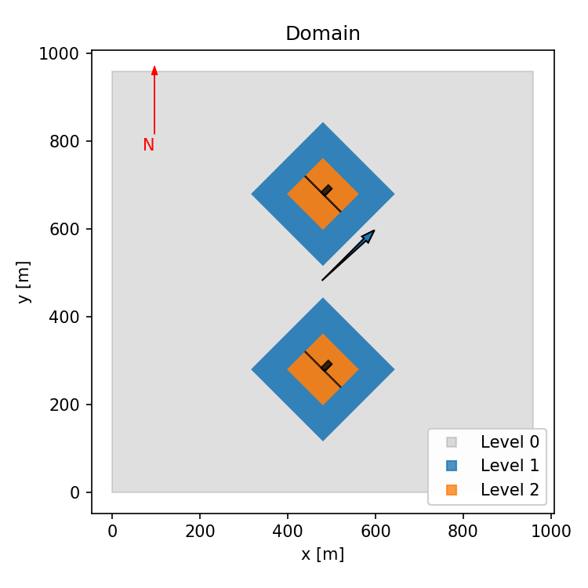
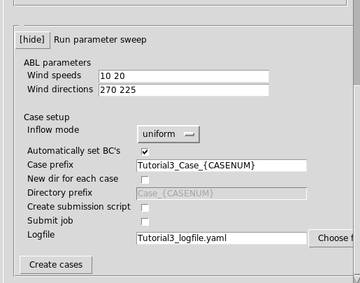

# Tutorial 3: Setting up a farm calculation

<!-- NOTE: The tutorial is actually generated by make_tutorial3.py -->

<!-- NOTE: Edit the template tutorial3gui_template.md file instead!
The actual markdown file is generated by
make_tutorial3_gui_markdownimages.py -->

<!-- Variables within braces (between { and }) will be replaced
by the python script make_tutorial3_gui_markdownimages.py -->

<!--INTROTEXT0-->
## Introduction

This tutorial will demonstrate the following features: 
- How to set up a wind farm layout with multiple turbines using
  `amrwind-frontend`.
- How to run a parameter sweep over wind speed and wind direction, and
  have `amrwind-frontend` generate the necessary input files for each
  case.
<!--INTROTEXT1-->

<!--WINDPROPSTART-->
## Set some wind properties

For the purposes of demonstrating how to setup a wind farm layout,
we'll start with some arbitrary wind speed and wind direction values.
The exact values don't really matter, as later on in the tutorial,
we'll change these values, but for now they'll be useful when plotting
the results.

Below we'll use a wind speed of 10 m/s and wind direction of 225
degrees.
<!--WINDPROPEND-->

In the **ABL** tab, set the following inputs according to this table:

| Input                   | Value      |
| ---                     | ---        |
| Use speed & dir instead | True |
| Wind speed              | 10       |
| Wind direction          | 225     |

The input field should look similar to:  


Then hit the **[Calc WS/WDir]** button, and it should fill in the
values of the Wind Vector appropriately.

## Create wind farm layout and domain

The first thing to do in setting the wind farm layout is to set the
location of each of the turbines. Click on the **Farm** tab, and hit
**[show]** next to **Wind farm turbine layout**.

Copy and paste this input into the **CSV Contents** window.
```
# CSV file should have columns with
# name, x, y, type, yaw, hubheight, options
T0, 500, 300, UnifCtTest, , ,
T1, 500, 700, UnifCtTest, , ,
```

If you have all of the turbine inputs in a separate CSV file, you can
also load them by hitting **[Choose file]**, then selecting the file,
and hitting **[Load/Reload]**.

The other inputs in the
| Input                    | value              |
| ---                      | ---                |
| Farm domain size (X,Y,Z) | [1000, 1000, 1000]       |
| Background mesh size [m] | 10 |


If you have questions about what each of the columns in the CSV input
mean, hit the **[?]** button.  You should see a help window that
resembles:

### TURBINE LAYOUT SPECIFICATIONS

| column      | description                                                                       | required/optional |
| ---         | ---                                                                               | ---               |
| `name`      | The name of the turbine (can be arbitrary).                                       | required          |
| `x`         | The x position of the turbine.                                                    | required          |
| `y`         | The y position of the turbine.                                                    | required          |
| `type`      | The turbine type (must be listed under turbine types tab)                         | required          |
| `yaw`       | The turbine yaw heading.  If not specified, turbine points directly into the wind | optional          |
| `hubheight` | The turbine hub-height.  If not specified, uses the default from the turbine type | optional          |
| `options`   | Optional parameters                                                               | optional          |


Press the **[Preview]** button under **Actions**.  It should generate
a turbine and domain layout image which resembles something like this:  


There should be two turbines labeled T1 and T0 in the middle of a 1 km
x 1 km domain.

If you want to adjust any turbine positions or orientations, go back
and edit the CSV input above.  Then press the **[Create turbines]**
button to actually create the turbines in the simulation.

To verify that the turbines are actually created, click the
**Turbines** tab and then look at the **Turbine List** under **Add
turbines here**.  You should see that both T0 and T1 are included in
the list:


## Create wind farm refinement zones  

Now around each turbine, we'll add some refinement zones so the
turbine rotors can be resolved.  Click back on the **Farm** tab, and
hit **[show]** next to **Farm refinement zones**.

```
# CSV file should have columns with
# level, upstream, downstream, lateral, below, above, options
level, upstream, downstream, lateral, below, above, options
0,     1,    1,   1,   0.75, 1,
1,     0.5,  0.5, 0.5, 0.75, 1,
```

Insert the above CSV text into the **CSV Contents** box, so the result
should look like:


If you have questions about what each of the CSV columns are supposed
to mean, hit the **[?]** button.  You should see a help window with
the following information:

### REFINEMENT SPECIFICATIONS

| column       | description                                                      | required/optional |
| ---          | ---                                                              | ---               |
| `level`      | The mesh level to apply the refinement.                          | required          |
| `upstream`   | The number of diameters or meters upstream to apply refinement   | required          |
| `downstream` | The number of diameters or meters downstream to apply refinement | required          |
| `lateral`    | The number of diameters or meters off to side of each turbine    | required          |
| `below`      | The number of diameters or meters below the turbine hub-height   | required          |
| `above`      | The number of diameters or meters above the turbine hub-height   | required          |
| `options`    | Any additional options (see below)                               | optional          |

### OPTIONAL INPUTS
| keyword       | default    | possible values               | description                                          |
| ---           | ---        | ---                           | ---                                                  |
| `orientation` | `winddir`  | `winddir`, `nacdir`, `x`, `y` | Which direction the refinement box should be pointed |
| `units`       | `diameter` | `diameter`, `meter`           | What units the values are in                         |
| `center`      | `turbine`  | `turbine`, `farm`             | Where the center of the refinement zone is located   |


Press the **[Create refinements]** button to ceate the refinement
zones.  Then, to see what the refinement zones look like, open the
plot domain dialog on the menu bar: **Plot**-->**Plot domain**.  You
should see that there 4 refinement zones present, and the two
previously created turbines also present.  


Hit **[Select all]** for both the refinement zones and turbines, then
press **[Plot Domain]**.  You should see both turbines plotted, and
each refinement level around the turbines shown.  Everything should be
oriented so that it points into the wind:



## Create sampling planes

Now that we have the refinement zones specified, we'd like to add some
sampling probes in front of every turbine, and also for the wind farm
as a whole.

On the **Farm** tab, and hit **[show]** next to **Farm sampling**.
Then copy the following CSV contents into the **CSV Contents** window.

```
# CSV file should have columns withturbinescsv=
# name, type, upstream, downstream, lateral, below, above, n1, n2, options
name, type, upstream, downstream, lateral, below, above, n1, n2, options
cl1, centerline, 1,  0, none, none,  none,  11, 11, none
rp1, rotorplane, 2,  0, none, none,  none,  11, 11, none
sw1, streamwise, 2,  1, 1, 0.5,  0.5,  11, 11, usedx:0.25 noffsets:1
hh,  hubheight,  2,  1, 1, 0,  none,  11, 11, usedx:0.25 center:farm orientation:x
```

The result should look similar to this: 


If you have any questions about what the columns in the CSV mean,
click on the **[?]** help button, and it should give you this
information:

### REFINEMENT SPECIFICATIONS

| column       | description                                                      | required/optional |
| ---          | ---                                                              | ---               |
| `level`      | The mesh level to apply the refinement.                          | required          |
| `upstream`   | The number of diameters or meters upstream to apply refinement   | required          |
| `downstream` | The number of diameters or meters downstream to apply refinement | required          |
| `lateral`    | The number of diameters or meters off to side of each turbine    | required          |
| `below`      | The number of diameters or meters below the turbine hub-height   | required          |
| `above`      | The number of diameters or meters above the turbine hub-height   | required          |
| `options`    | Any additional options (see below)                               | optional          |

### OPTIONAL INPUTS
| keyword       | default    | possible values               | description                                          |
| ---           | ---        | ---                           | ---                                                  |
| `orientation` | `winddir`  | `winddir`, `nacdir`, `x`, `y` | Which direction the refinement box should be pointed |
| `units`       | `diameter` | `diameter`, `meter`           | What units the values are in                         |
| `center`      | `turbine`  | `turbine`, `farm`             | Where the center of the refinement zone is located   |


To generate the actual sampling planes, hit the **Create sampling
probes** button under Actions.  That should generate 7 sampling
planes.  To view them, go back to the plot domain dialog on the menu
bar: **Plot**-->**Plot domain**.  This time there should be all of the
sampling probe geometries listed, along with the refinement zones, and
created turbines as well.  


Click on the **[Select All]** button for each selection window (that
will plot all objects in the simulation), and then press the **[Plot
Domain]** button.  That will generate an image similar to the one
below:


## See the output 

To see what the AMR-Wind input file would look like, you can go to the
menu bar, select **Run** --> **Preview Input File**, to see the
preview window (you can also just hit **File** --> **Save input file
as** to save it to a file).

The input file should look similar to:  
<details>
  <summary>[input file]</summary>
<pre>
# --- Simulation time control parameters ---
time.stop_time                           = 100.0               # Max (simulated) time to evolve [s]
time.max_step                            = -1                  
time.fixed_dt                            = -1.0                # Fixed timestep size (in seconds). If negative, then time.cfl is used
incflo.verbose                           = 0                   
io.check_file                            = chk                 
incflo.use_godunov                       = true                
incflo.godunov_type                      = ppm                 
incflo.gravity                           = 0.0 0.0 -9.81       # Gravitational acceleration vector (x,y,z) [m/s^2]
incflo.density                           = 1.0                 # Fluid density [kg/m^3]
transport.viscosity                      = 1.872e-05           # Fluid dynamic viscosity [kg/m-s]
transport.laminar_prandtl                = 0.7                 # Laminar prandtl number
transport.turbulent_prandtl              = 0.3333              # Turbulent prandtl number
# --- Geometry and Mesh ---
geometry.prob_lo                         = 0.0 0.0 0.0         
geometry.prob_hi                         = 1000.0 1000.0 1000.0
amr.n_cell                               = 100 100 100         # Number of cells in x, y, and z directions
amr.max_level                            = 2                   
geometry.is_periodic                     = 1 1 0               
zlo.type                                 = no_slip_wall        
zhi.type                                 = no_slip_wall        
# --- ABL parameters ---
ICNS.source_terms                        =    ActuatorForcing  
ABLForcing.abl_forcing_height            = 0.0                 
time.plot_interval                       = 1000                
io.plot_file                             = plt                 
io.KE_int                                = -1                  
incflo.post_processing                   = sampling            
# --- Sampling parameters ---
sampling.output_frequency                = 100                 
sampling.fields                          = velocity            
#---- sample defs ----
sampling.labels                          = T0_cl1 T1_cl1 T0_rp1 T1_rp1 T0_sw1 T1_sw1 Farm_hh
sampling.T0_cl1.type                     = LineSampler         
sampling.T0_cl1.num_points               = 11                  
sampling.T0_cl1.start                    = 417.975613382 217.975613382 80.0
sampling.T0_cl1.end                      = 500.0 300.0 80.0    
sampling.T1_cl1.type                     = LineSampler         
sampling.T1_cl1.num_points               = 11                  
sampling.T1_cl1.start                    = 417.975613382 617.975613382 80.0
sampling.T1_cl1.end                      = 500.0 700.0 80.0    
sampling.T0_rp1.type                     = PlaneSampler        
sampling.T0_rp1.num_points               = 11 11               
sampling.T0_rp1.origin                   = 294.939033456 176.963420074 22.0
sampling.T0_rp1.axis1                    = 82.0243866176 -82.0243866176 0.0
sampling.T0_rp1.axis2                    = 0.0 0.0 116.0       
sampling.T0_rp1.normal                   = 0.0 0.0 0.0         
sampling.T1_rp1.type                     = PlaneSampler        
sampling.T1_rp1.num_points               = 11 11               
sampling.T1_rp1.origin                   = 294.939033456 576.963420074 22.0
sampling.T1_rp1.axis1                    = 82.0243866176 -82.0243866176 0.0
sampling.T1_rp1.axis2                    = 0.0 0.0 116.0       
sampling.T1_rp1.normal                   = 0.0 0.0 0.0         
sampling.T0_sw1.type                     = PlaneSampler        
sampling.T0_sw1.num_points               = 13 5                
sampling.T0_sw1.origin                   = 335.951226765 135.951226765 22.0
sampling.T0_sw1.axis1                    = 246.073159853 246.073159853 0.0
sampling.T0_sw1.axis2                    = 0.0 0.0 116.0       
sampling.T0_sw1.normal                   = 0.707106781187 -0.707106781187 0.0
sampling.T0_sw1.offsets                  = 0.0 116.0           
sampling.T1_sw1.type                     = PlaneSampler        
sampling.T1_sw1.num_points               = 13 5                
sampling.T1_sw1.origin                   = 335.951226765 535.951226765 22.0
sampling.T1_sw1.axis1                    = 246.073159853 246.073159853 0.0
sampling.T1_sw1.axis2                    = 0.0 0.0 116.0       
sampling.T1_sw1.normal                   = 0.707106781187 -0.707106781187 0.0
sampling.T1_sw1.offsets                  = 0.0 116.0           
sampling.Farm_hh.type                    = PlaneSampler        
sampling.Farm_hh.num_points              = 13 9                
sampling.Farm_hh.origin                  = 268.0 384.0 80.0    
sampling.Farm_hh.axis1                   = 348.0 0.0 0.0       
sampling.Farm_hh.axis2                   = 0.0 232.0 0.0       
sampling.Farm_hh.normal                  = 0.0 0.0 0.0         
#---- tagging defs ----
tagging.labels                           = T0_level_0_zone T1_level_0_zone T0_level_1_zone T1_level_1_zone
tagging.T0_level_0_zone.type             = GeometryRefinement  
tagging.T0_level_0_zone.shapes           = T0_level_0_zone     
tagging.T0_level_0_zone.level            = 0                   
tagging.T0_level_0_zone.T0_level_0_zone.type = box                 
tagging.T0_level_0_zone.T0_level_0_zone.origin = 335.951226765 300.0 -7.0
tagging.T0_level_0_zone.T0_level_0_zone.xaxis = 164.048773235 164.048773235 0.0
tagging.T0_level_0_zone.T0_level_0_zone.yaxis = 164.048773235 -164.048773235 0.0
tagging.T0_level_0_zone.T0_level_0_zone.zaxis = 0.0 0.0 203.0       
tagging.T1_level_0_zone.type             = GeometryRefinement  
tagging.T1_level_0_zone.shapes           = T1_level_0_zone     
tagging.T1_level_0_zone.level            = 0                   
tagging.T1_level_0_zone.T1_level_0_zone.type = box                 
tagging.T1_level_0_zone.T1_level_0_zone.origin = 335.951226765 700.0 -7.0
tagging.T1_level_0_zone.T1_level_0_zone.xaxis = 164.048773235 164.048773235 0.0
tagging.T1_level_0_zone.T1_level_0_zone.yaxis = 164.048773235 -164.048773235 0.0
tagging.T1_level_0_zone.T1_level_0_zone.zaxis = 0.0 0.0 203.0       
tagging.T0_level_1_zone.type             = GeometryRefinement  
tagging.T0_level_1_zone.shapes           = T0_level_1_zone     
tagging.T0_level_1_zone.level            = 1                   
tagging.T0_level_1_zone.T0_level_1_zone.type = box                 
tagging.T0_level_1_zone.T0_level_1_zone.origin = 417.975613382 300.0 -7.0
tagging.T0_level_1_zone.T0_level_1_zone.xaxis = 82.0243866176 82.0243866176 0.0
tagging.T0_level_1_zone.T0_level_1_zone.yaxis = 82.0243866176 -82.0243866176 0.0
tagging.T0_level_1_zone.T0_level_1_zone.zaxis = 0.0 0.0 203.0       
tagging.T1_level_1_zone.type             = GeometryRefinement  
tagging.T1_level_1_zone.shapes           = T1_level_1_zone     
tagging.T1_level_1_zone.level            = 1                   
tagging.T1_level_1_zone.T1_level_1_zone.type = box                 
tagging.T1_level_1_zone.T1_level_1_zone.origin = 417.975613382 700.0 -7.0
tagging.T1_level_1_zone.T1_level_1_zone.xaxis = 82.0243866176 82.0243866176 0.0
tagging.T1_level_1_zone.T1_level_1_zone.yaxis = 82.0243866176 -82.0243866176 0.0
tagging.T1_level_1_zone.T1_level_1_zone.zaxis = 0.0 0.0 203.0       
#---- actuator defs ----
Actuator.labels                          = T0 T1               
Actuator.T0.type                         = UniformCtDisk       
Actuator.T0.base_position                = 500.0 300.0 0.0     
Actuator.T0.rotor_diameter               = 116.0               
Actuator.T0.hub_height                   = 80.0                
Actuator.T0.yaw                          = 225.0               
Actuator.T1.type                         = UniformCtDisk       
Actuator.T1.base_position                = 500.0 700.0 0.0     
Actuator.T1.rotor_diameter               = 116.0               
Actuator.T1.hub_height                   = 80.0                
Actuator.T1.yaw                          = 225.0               
#---- extra params ----
#== END AMR-WIND INPUT ==
</pre>
</details>

## Set up a wind sweep

The above instructions were to set up a single case with one wind
speed (10 m/s) and one wind direction (225) degrees.  Now we'll
show what happens when you want to vary these to run a parameter
sweep.  Hit **[show]** next to **Run parameter sweep**, and put in the
following inputs:

| Input                 | Value              |
| ---                   | ---                |
| Wind speeds           | 10 20 |
| Wind directions       | 270 225   |
| Case prefix           | Tutorial3_Case_{CASENUM}       |
| New dir for each case | False       |
| Logfile               | Tutorial3_logfile.yaml          |

The set up should be similar to: 



Then hit the **[Create cases]** button.  Four input files should be generated:
```
Tutorial3_Case_0.inp
Tutorial3_Case_1.inp
Tutorial3_Case_2.inp
Tutorial3_Case_3.inp
```
as well as the yaml log file [`Tutorial3_logfile.yaml`](Tutorial3_logfile.yaml) which should look similar to this:  

```yaml
Tutorial3_Case_0:
    casename: Tutorial3_Case_0
    WDir: 270.0
    submitted: false
    WS: 10.0
    dir: /gpfs/lcheung/tmp/createdocs/amrwind-frontend/docs/tutorial3
    inputfile: Tutorial3_Case_0.inp
Tutorial3_Case_1:
    casename: Tutorial3_Case_1
    WDir: 225.0
    submitted: false
    WS: 10.0
    dir: /gpfs/lcheung/tmp/createdocs/amrwind-frontend/docs/tutorial3
    inputfile: Tutorial3_Case_1.inp
Tutorial3_Case_2:
    casename: Tutorial3_Case_2
    WDir: 270.0
    submitted: false
    WS: 20.0
    dir: /gpfs/lcheung/tmp/createdocs/amrwind-frontend/docs/tutorial3
    inputfile: Tutorial3_Case_2.inp
Tutorial3_Case_3:
    casename: Tutorial3_Case_3
    WDir: 225.0
    submitted: false
    WS: 20.0
    dir: /gpfs/lcheung/tmp/createdocs/amrwind-frontend/docs/tutorial3
    inputfile: Tutorial3_Case_3.inp

```

<!--SAVESETUPSTART-->
## Save the wind farm setup

After doing all of this wind farm setup work, we can save all of these
settings so that they can be reloaded and modified for future use.
<!--SAVESETUPEND-->

At the top of the farm tab, expand the **Options** field and put in
the following inputs:

| Input           | Value               |
|-----------------|---------------------|
| Farm setup file | Tutorial3_WindFarmSetup.yaml    |
| User comments   | Tutorial3 wind farm setup parameters. |

Note that the user comments field is arbitrary.  The input fields
should look like:


Then press the **[Save YAML]** button under **Actions**.  You should
see the file [`Tutorial3_WindFarmSetup.yaml`](Tutorial3_WindFarmSetup.yaml) created, which
will look similar to this:

<details>
  <summary>[Tutorial3_WindFarmSetup.yaml]</summary>
<pre>
# ----- BEGIN Farm setup input file ----
# User comments
farm_usercomments: Tutorial3 wind farm setup parameters.
# Turbine layout
turbines_csvtextbox: |-
    # CSV file should have columns with
    # name, x, y, type, yaw, hubheight, options
    T0, 500, 300, UnifCtTest, , ,
    T1, 500, 700, UnifCtTest, , ,
turbines_csvfile: ''                    # CSV input file
turbines_deleteprev: true               # Remove all existing turbines before adding these
turbines_coordsys: xy
turbines_autocalccenter: true           # Automatically set farm center to be average of all turbine locations
turbines_farmcenter:
-   500.0
-   500.0
turbines_domainsize:                    # Size of the computational domain in meters
    -   1000.0
    -   1000.0
    -   1000.0
turbines_backgroundmeshsize: 10.0       # Size of the background mesh in meters (optional)
# Refine inputs
refine_csvtextbox: |-
    # CSV file should have columns with
    # level, upstream, downstream, lateral, below, above, options
    level, upstream, downstream, lateral, below, above, options
    0,     1,    1,   1,   0.75, 1,
    1,     0.5,  0.5, 0.5, 0.75, 1,
refine_csvfile: ''                      # CSV input file
refine_deleteprev: true                 # Remove all existing refinement zones before adding these
# Sampling inputs
sampling_csvtextbox: |-
    # CSV file should have columns withturbinescsv=
    # name, type, upstream, downstream, lateral, below, above, n1, n2, options
    name, type, upstream, downstream, lateral, below, above, n1, n2, options
    cl1, centerline, 1,  0, none, none,  none,  11, 11, none
    rp1, rotorplane, 2,  0, none, none,  none,  11, 11, none
    sw1, streamwise, 2,  1, 1, 0.5,  0.5,  11, 11, usedx:0.25 noffsets:1
    hh,  hubheight,  2,  1, 1, 0,  none,  11, 11, usedx:0.25 center:farm orientation:x
sampling_csvfile: ''                    # CSV input file
sampling_deleteprev: true               # Remove all existing sampling probes before adding these
#  
sweep_windspeeds: 10 20                 ## List of wind speeds to sweep [m/s]
sweep_winddirs: 270 225                 # List of wind directions to sweep [deg]
sweep_inflowmode: uniform               # Type of inflow velocity to wind farm
sweep_autosetBC: true                   # Automatically setup the boundary conditions for each wind direction
sweep_caseprefix: Tutorial3_Case_{CASENUM} # Case prefix (python format strings allowed)
sweep_usenewdirs: false                 # Create a new directory for each case
sweep_dirprefix: Case_{CASENUM}         # Directory prefix (python format strings allowed)
sweep_createsubmitscript: false         # Create a submission script for each case
sweep_submitjob: false                  # Submit each job to the queue
sweep_logfile: Tutorial3_logfile.yaml   # Log file to record each run
# ___Embedded AMR-Wind input____
wfarm_embedamrwindinput: |
    # --- Simulation time control parameters ---
    time.stop_time                           = 100.0               # Max (simulated) time to evolve [s]
    time.max_step                            = -1
    time.fixed_dt                            = -1.0                # Fixed timestep size (in seconds). If negative, then time.cfl is used
    incflo.verbose                           = 0
    io.check_file                            = chk
    incflo.use_godunov                       = true
    incflo.godunov_type                      = ppm
    incflo.gravity                           = 0.0 0.0 -9.81       # Gravitational acceleration vector (x,y,z) [m/s^2]
    incflo.density                           = 1.0                 # Fluid density [kg/m^3]
    transport.viscosity                      = 1.872e-05           # Fluid dynamic viscosity [kg/m-s]
    transport.laminar_prandtl                = 0.7                 # Laminar prandtl number
    transport.turbulent_prandtl              = 0.3333              # Turbulent prandtl number
    ConstValue.velocity.value                = 14.1421356237 14.1421356237 0.0
    # --- Geometry and Mesh ---
    geometry.prob_lo                         = 0.0 0.0 0.0
    geometry.prob_hi                         = 1000.0 1000.0 1000.0
    amr.n_cell                               = 100 100 100         # Number of cells in x, y, and z directions
    amr.max_level                            = 2
    geometry.is_periodic                     = 0 0 0
    xlo.type                                 = mass_inflow
    xlo.density                              = 1.0
    xlo.velocity                             = 14.1421356237 14.1421356237 0.0
    xhi.type                                 = pressure_outflow
    ylo.type                                 = mass_inflow
    ylo.temperature_type                     = wall_model
    ylo.density                              = 1.0
    ylo.velocity                             = 14.1421356237 14.1421356237 0.0
    yhi.type                                 = pressure_outflow
    yhi.temperature_type                     = fixed_gradient
    zlo.type                                 = no_slip_wall
    zhi.type                                 = no_slip_wall
    # --- ABL parameters ---
    ICNS.source_terms                        =    ActuatorForcing
    ABLForcing.abl_forcing_height            = 0.0
    time.plot_interval                       = 1000
    io.plot_file                             = plt
    io.KE_int                                = -1
    incflo.post_processing                   = sampling
    # --- Sampling parameters ---
    sampling.output_frequency                = 100
    sampling.fields                          = velocity
    #---- sample defs ----
    sampling.labels                          = T0_cl1 T1_cl1 T0_rp1 T1_rp1 T0_sw1 T1_sw1 Farm_hh
    sampling.T0_cl1.type                     = LineSampler
    sampling.T0_cl1.num_points               = 11
    sampling.T0_cl1.start                    = 417.975613382 217.975613382 80.0
    sampling.T0_cl1.end                      = 500.0 300.0 80.0
    sampling.T1_cl1.type                     = LineSampler
    sampling.T1_cl1.num_points               = 11
    sampling.T1_cl1.start                    = 417.975613382 617.975613382 80.0
    sampling.T1_cl1.end                      = 500.0 700.0 80.0
    sampling.T0_rp1.type                     = PlaneSampler
    sampling.T0_rp1.num_points               = 11 11
    sampling.T0_rp1.origin                   = 294.939033456 176.963420074 22.0
    sampling.T0_rp1.axis1                    = 82.0243866176 -82.0243866176 0.0
    sampling.T0_rp1.axis2                    = 0.0 0.0 116.0
    sampling.T0_rp1.normal                   = 0.0 0.0 0.0
    sampling.T1_rp1.type                     = PlaneSampler
    sampling.T1_rp1.num_points               = 11 11
    sampling.T1_rp1.origin                   = 294.939033456 576.963420074 22.0
    sampling.T1_rp1.axis1                    = 82.0243866176 -82.0243866176 0.0
    sampling.T1_rp1.axis2                    = 0.0 0.0 116.0
    sampling.T1_rp1.normal                   = 0.0 0.0 0.0
    sampling.T0_sw1.type                     = PlaneSampler
    sampling.T0_sw1.num_points               = 13 5
    sampling.T0_sw1.origin                   = 335.951226765 135.951226765 22.0
    sampling.T0_sw1.axis1                    = 246.073159853 246.073159853 0.0
    sampling.T0_sw1.axis2                    = 0.0 0.0 116.0
    sampling.T0_sw1.normal                   = 0.707106781187 -0.707106781187 0.0
    sampling.T0_sw1.offsets                  = 0.0 116.0
    sampling.T1_sw1.type                     = PlaneSampler
    sampling.T1_sw1.num_points               = 13 5
    sampling.T1_sw1.origin                   = 335.951226765 535.951226765 22.0
    sampling.T1_sw1.axis1                    = 246.073159853 246.073159853 0.0
    sampling.T1_sw1.axis2                    = 0.0 0.0 116.0
    sampling.T1_sw1.normal                   = 0.707106781187 -0.707106781187 0.0
    sampling.T1_sw1.offsets                  = 0.0 116.0
    sampling.Farm_hh.type                    = PlaneSampler
    sampling.Farm_hh.num_points              = 13 9
    sampling.Farm_hh.origin                  = 268.0 384.0 80.0
    sampling.Farm_hh.axis1                   = 348.0 0.0 0.0
    sampling.Farm_hh.axis2                   = 0.0 232.0 0.0
    sampling.Farm_hh.normal                  = 0.0 0.0 0.0
    #---- tagging defs ----
    tagging.labels                           = T0_level_0_zone T1_level_0_zone T0_level_1_zone T1_level_1_zone
    tagging.T0_level_0_zone.type             = GeometryRefinement
    tagging.T0_level_0_zone.shapes           = T0_level_0_zone
    tagging.T0_level_0_zone.level            = 0
    tagging.T0_level_0_zone.T0_level_0_zone.type = box
    tagging.T0_level_0_zone.T0_level_0_zone.origin = 335.951226765 300.0 -7.0
    tagging.T0_level_0_zone.T0_level_0_zone.xaxis = 164.048773235 164.048773235 0.0
    tagging.T0_level_0_zone.T0_level_0_zone.yaxis = 164.048773235 -164.048773235 0.0
    tagging.T0_level_0_zone.T0_level_0_zone.zaxis = 0.0 0.0 203.0
    tagging.T1_level_0_zone.type             = GeometryRefinement
    tagging.T1_level_0_zone.shapes           = T1_level_0_zone
    tagging.T1_level_0_zone.level            = 0
    tagging.T1_level_0_zone.T1_level_0_zone.type = box
    tagging.T1_level_0_zone.T1_level_0_zone.origin = 335.951226765 700.0 -7.0
    tagging.T1_level_0_zone.T1_level_0_zone.xaxis = 164.048773235 164.048773235 0.0
    tagging.T1_level_0_zone.T1_level_0_zone.yaxis = 164.048773235 -164.048773235 0.0
    tagging.T1_level_0_zone.T1_level_0_zone.zaxis = 0.0 0.0 203.0
    tagging.T0_level_1_zone.type             = GeometryRefinement
    tagging.T0_level_1_zone.shapes           = T0_level_1_zone
    tagging.T0_level_1_zone.level            = 1
    tagging.T0_level_1_zone.T0_level_1_zone.type = box
    tagging.T0_level_1_zone.T0_level_1_zone.origin = 417.975613382 300.0 -7.0
    tagging.T0_level_1_zone.T0_level_1_zone.xaxis = 82.0243866176 82.0243866176 0.0
    tagging.T0_level_1_zone.T0_level_1_zone.yaxis = 82.0243866176 -82.0243866176 0.0
    tagging.T0_level_1_zone.T0_level_1_zone.zaxis = 0.0 0.0 203.0
    tagging.T1_level_1_zone.type             = GeometryRefinement
    tagging.T1_level_1_zone.shapes           = T1_level_1_zone
    tagging.T1_level_1_zone.level            = 1
    tagging.T1_level_1_zone.T1_level_1_zone.type = box
    tagging.T1_level_1_zone.T1_level_1_zone.origin = 417.975613382 700.0 -7.0
    tagging.T1_level_1_zone.T1_level_1_zone.xaxis = 82.0243866176 82.0243866176 0.0
    tagging.T1_level_1_zone.T1_level_1_zone.yaxis = 82.0243866176 -82.0243866176 0.0
    tagging.T1_level_1_zone.T1_level_1_zone.zaxis = 0.0 0.0 203.0
    #---- actuator defs ----
    Actuator.labels                          = T0 T1
    Actuator.T0.type                         = UniformCtDisk
    Actuator.T0.base_position                = 500.0 300.0 0.0
    Actuator.T0.rotor_diameter               = 116.0
    Actuator.T0.hub_height                   = 80.0
    Actuator.T0.yaw                          = 225.0
    Actuator.T1.type                         = UniformCtDisk
    Actuator.T1.base_position                = 500.0 700.0 0.0
    Actuator.T1.rotor_diameter               = 116.0
    Actuator.T1.hub_height                   = 80.0
    Actuator.T1.yaw                          = 225.0
    #---- extra params ----
    #== END AMR-WIND INPUT ==
wfarm_embedturbinetype:
    UnifCtTest: !!omap
    -   turbinetype_name: UnifCtTest
    -   turbinetype_comment: Test UnifCtDisk
    -   Actuator_type: UniformCtDisk
    -   Actuator_openfast_input_file:
    -   Actuator_rotor_diameter: 116
    -   Actuator_hub_height: 80
    -   Actuator_num_points_blade:
    -   Actuator_num_points_tower:
    -   Actuator_epsilon:
    -   Actuator_epsilon_tower:
    -   Actuator_openfast_start_time:
    -   Actuator_openfast_stop_time:
    -   Actuator_nacelle_drag_coeff:
    -   Actuator_nacelle_area:
    -   Actuator_output_frequency:
    -   turbinetype_filelocation: /gpfs/lcheung/tmp/createdocs/amrwind-frontend/turbines
    -   turbinetype_filedir:
# ----- END Farm setup input file ------
</pre>
</details>
