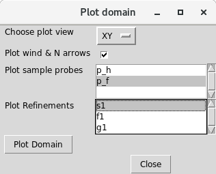
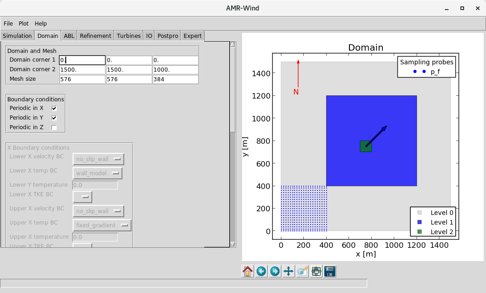
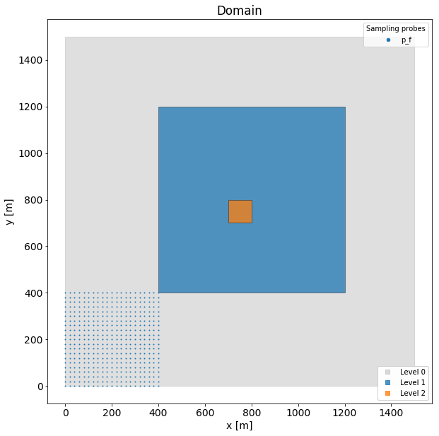

# Plotting the domain

## Through the interactive gui

1. Start `amrwind_frontend` and load the input file with the domain.
   You can specify the input file on the command line:
   ```bash
   $ ./amrwind_frontend.py sample.inp
   ```
   or launch the `amrwind_frontend.py` first, then select `File` ->
   `Import AMR-Wind file` to choose the file.

2.  Select `Plot`->`Plot domain` from the menu bar.  This should bring
    up a plot domain window like below:
	
    
	
3.  Choose the features to plot.  For instance, in the picture above,
    the `p_f` sampling plane is chosen, which is the small blue plane
    in the corner.  Also, the static refinement box `s1` was also
    plotted in the picture, which consists of two levels.

    
	
	
## In python or in a jupyter notebook 
The same actions can be accomplished through python or in a jupyter
notebook.  For instance, you can see it being used in this notebook:
[plotdomain.ipynb](plotdomain.ipynb).

In python, first load the `amrwind_frontend library` and matplotlib:
```python
# Important header information
amrwindfedir = '../'   # where amrwind-frontend is located
import sys, os
sys.path.insert(1, amrwindfedir)

# Load the libraries
import matplotlib.pyplot    as plt
import amrwind_frontend as amrwind
```

Then start the main app and load the `sample.inp` input file
```python
# Start the amrwind_frontend app 
app=amrwind.MyApp.init_nogui()
# Load the input file
os.chdir(amrwindfedir)
app.loadAMRWindInput('sample.inp');
```

Plot options are available through the
`app.popup_storteddata['plotdomain']` dictionary:
```python
print(app.popup_storteddata['plotdomain'])
```
which looks like
```python
OrderedDict([('plot_chooseview', 'XY'), ('plot_windnortharrows', True), ('plot_sampleprobes', None), ('plot_refineboxes', None)])
```

Finally, you can set some of the options about what to plot:  
```python
# Set some options about what to plot
app.popup_storteddata['plotdomain']['plot_windnortharrows']=False
app.popup_storteddata['plotdomain']['plot_sampleprobes']=['p_f']
app.popup_storteddata['plotdomain']['plot_refineboxes']=['s1']
```
And create the plot
```python
plt.rc('font', size=14)
fig, ax = plt.subplots(figsize=(10,10), facecolor='w')
app.plotDomain(ax=ax)
```

This should result in

