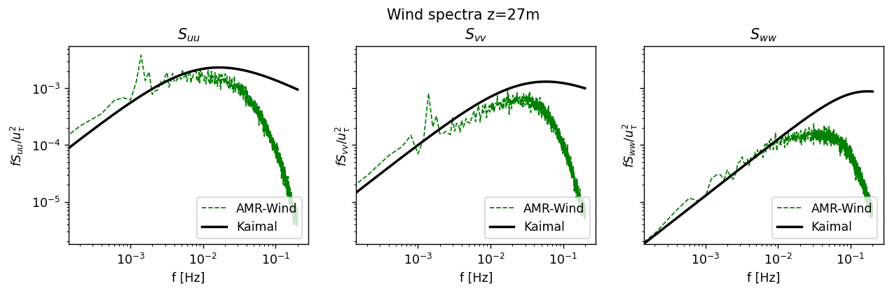

# windspectra

Calculate the wind spectra in time
## Inputs: 
```
  name                : An arbitrary name (Required)
  ncfile              : NetCDF file (Required)
  group               : Group name in netcdf file (Required)
  pointlocationfunction: Function to call to generate point locations. Function should have no arguments and return a list of (i,j,k) indices (Required)
  csvfile             : Filename to save spectra to (Required)
  timeindices         : Which indices to use from netcdf file (Optional, Default: [])
  avgbins             : Averaging time windows (Optional, Default: [])
  thirdoctaveband     : Use 1/3 octave band averaging (Optional, Default: False)
  normalize           : Normalize the output spectra f and U^2 (Optional, Default: True)
```

## Actions: 
```
  kaimal              : ACTION: Get the Kaimal spectra (Optional)
    csvfile           : CSV file to save Kaimal spectra to (Required)
    ustarsource       : Source of ustar information (Options: specified/ablstatsfile) (Required)
    ustar             : Group name in netcdf file (Optional, Default: 0.0)
    z                 : z-height for Kaimal spectra (Required)
    ablstatsfile      : NetCDF abl statistics file (Optional, Default: '')
    avgt              : Average time over ustar (Optional, Default: [])
```

## Notes


The non-dimensional Kaimal spectra is defined by 

$$
f S_i/U^2  = \frac{a n}{(1+b n^\alpha)^\beta}
$$

where $n=fz/U$, where $U$ is the reference velocity (commonly taken to be friction velocity $u_\tau$), and the constants for each direction $i$ are given by 

| i   | $a$ | $b$ | $\alpha$ | $\beta$ | 
| --- | --- | --- | ---      | --- |
| uu  | 105.0 | 33.0 | 1.0   | 5/3 |
| vv  | 17.0  | 9.5  | 1.0   | 5/3 |
| ww  | 2.1   | 5.3  | 5/3   | 1   |


### References
1. [https://www.nwpsaf.eu/publications/tech_reports/nwpsaf-kn-tr-008.pdf](https://www.nwpsaf.eu/publications/tech_reports/nwpsaf-kn-tr-008.pdf)


## Example

This example from the ExaWind benchmarks 

```yaml
windspectra:
- name: spectraZ027
  ncfile: /gpfs/lcheung/HFM/exawind-benchmarks/convective_abl/post_processing/XYdomain_027_30000.nc
  group: Farm_XYdomain027
  pointlocationfunction: postproengine.spectrapoints
  csvfile: ../results/spectra_Z027.csv
  #avgbins:  [15000, 15010]
  kaimal:
    ustarsource: ablstatsfile
    ablstatsfile:  /gpfs/lcheung/HFM/exawind-benchmarks/convective_abl/post_processing/abl_statistics30000.nc
    avgt: [15000, 20000]
    #ustar: 0.289809
    csvfile: ../results/kaimal_Z027.csv
    z: 27.0
```

The results can be plotted with this `plotcsv` executor:
```
plotcsv:
  - name: plotSuuZ027
    xlabel: 'f [Hz]'
    ylabel: '$f S_{uu}/u_{\tau}^2$'
    xscale: log
    yscale: log
    title: '$S_{uu}$'
    figsize: [5,4]
    legendopts: {'loc':'lower right'}
    figname: Z027
    axesnum: 0
    csvfiles:
    - {'file':'../results/spectra_Z027.csv', 'xcol':'f', 'ycol':'Suu', 'lineopts':{'color':'g', 'lw':1, 'linestyle':'--', 'label':'AMR-Wind'}}
    - {'file':'../results/kaimal_Z027.csv',  'xcol':'f', 'ycol':'Suu', 'lineopts':{'color':'k', 'lw':2, 'linestyle':'-', 'label':'Kaimal'}}
  - name: plotSvvZ027
    xlabel: 'f [Hz]'
    ylabel: '$f S_{vv}/u_{\tau}^2$'
    xscale: log
    yscale: log
    title: '$S_{vv}$'
    figsize: [5,4]
    legendopts: {'loc':'lower right'}
    figname: Z027
    axesnum: 1
    csvfiles:
    - {'file':'../results/spectra_Z027.csv', 'xcol':'f', 'ycol':'Svv', 'lineopts':{'color':'g', 'lw':1, 'linestyle':'--', 'label':'AMR-Wind'}}
    - {'file':'../results/kaimal_Z027.csv',  'xcol':'f', 'ycol':'Svv', 'lineopts':{'color':'k', 'lw':2, 'linestyle':'-', 'label':'Kaimal'}}
  - name: plotSwwZ027
    xlabel: 'f [Hz]'
    ylabel: '$f S_{ww}/u_{\tau}^2$'
    xscale: log
    yscale: log
    title: '$S_{ww}$'
    figsize: [5,4]
    legendopts: {'loc':'lower right'}
    figname: Z027
    axesnum: 2
    csvfiles:
    - {'file':'../results/spectra_Z027.csv', 'xcol':'f', 'ycol':'Sww', 'lineopts':{'color':'g', 'lw':1, 'linestyle':'--', 'label':'AMR-Wind'}}
    - {'file':'../results/kaimal_Z027.csv',  'xcol':'f', 'ycol':'Sww', 'lineopts':{'color':'k', 'lw':2, 'linestyle':'-', 'label':'Kaimal'}}
```
Note that these figures need to be created before plotting:
```python
fig1, axs = plt.subplots(1,3,num="Z027", figsize=(12,3), dpi=125, sharey=True)
fig1.suptitle('Wind spectra z=27m', y=1.025)
ppeng.driver(yamldict, verbose=True)
```
Leading to the following image:


